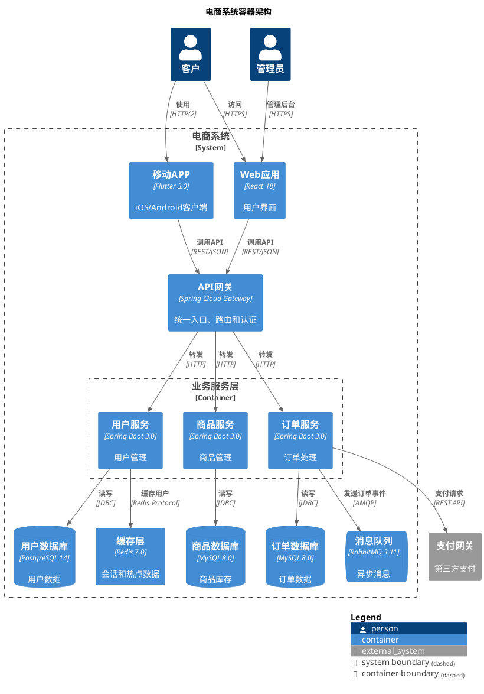
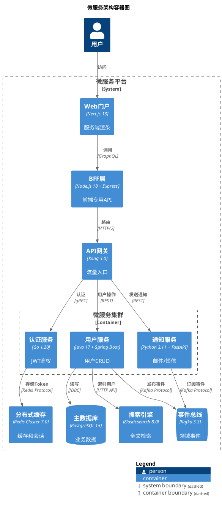
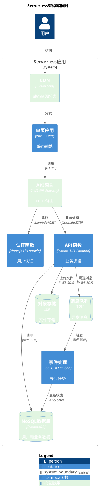

核心语法要点：
- 强制包裹: @startuml 和 @enduml
- 强制库引用: !include <C4/C4_Container>
  * 注意: Container库继承Context，可定义Person和System
  * ❌ Kroki 不支持在线 URL include（安全限制）

容器元素定义：
- 通用容器: Container(alias, "名称", "技术栈", "描述", ?sprite, ?tags, ?link, ?baseShape)
- 数据库容器: ContainerDb(alias, "数据库名", "数据库类型", "描述", ?sprite, ?tags, ?link)
- 消息队列容器: ContainerQueue(alias, "队列名", "队列技术", "描述", ?sprite, ?tags, ?link)
- 外部容器: Container_Ext(alias, "外部服务", "技术", "描述", ?sprite, ?tags, ?link, ?baseShape)
- 外部数据库: ContainerDb_Ext(alias, "外部DB", "类型", "描述", ?sprite, ?tags, ?link)
- 外部队列: ContainerQueue_Ext(alias, "外部MQ", "技术", "描述", ?sprite, ?tags, ?link)

容器边界：
- Container_Boundary(alias, "名称") { ... }
- 可嵌套多个Container定义
- 边界用于模块划分

技术栈标注：
- 第三个参数必须包含技术栈信息
- 示例: "Spring Boot", "React 18", "PostgreSQL 14", "Redis 6.2"
- 技术栈会在容器内显示为 [技术栈] 格式

关系定义（继承Context）：
- Rel(from, to, "描述", "技术/协议")
- 常见协议: "REST/JSON", "gRPC", "GraphQL", "JDBC", "AMQP", "WebSocket"
- 异步消息: 使用Rel_Back表示回调或消息响应

布局和样式：
- LAYOUT_TOP_DOWN() - 上下布局（默认）
- LAYOUT_LEFT_RIGHT() - 左右布局
- LAYOUT_LANDSCAPE() - 横向布局（适合宽屏）
- SHOW_LEGEND() - 显示图例
- HIDE_STEREOTYPE() - 隐藏<<container>>标签
- SetDefaultLegendEntries("人员\n系统\n容器") - 自定义图例

高级特性：
- 容器组: ContainerBoundary 可嵌套多层
- 技术债标记: 使用$tags标记"legacy"或"deprecated"
- 性能关键路径: 使用AddRelTag()定义特殊关系样式
- 数据流方向: 使用Rel_U/D/L/R明确数据流向

最佳实践：
- 粒度控制: 5-15个容器，避免过度复杂
- 技术栈一致性: 统一技术栈命名格式（含版本号）
- 分层清晰: 前端/后端/数据层分离
- 职责单一: 每个容器职责明确

常见模式：
- 三层架构: Web容器 -> API容器 -> 数据库容器
- 微服务: 多个独立容器 + 消息队列 + 服务网格
- 前后端分离: SPA容器 + API Gateway容器 + 多个微服务容器

## 示例

### 示例 1

### 示例 2

### 示例 3

