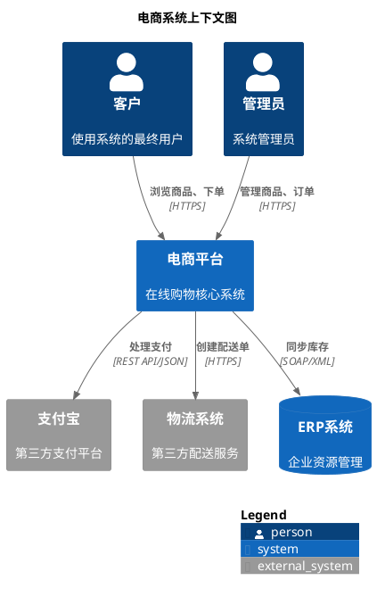
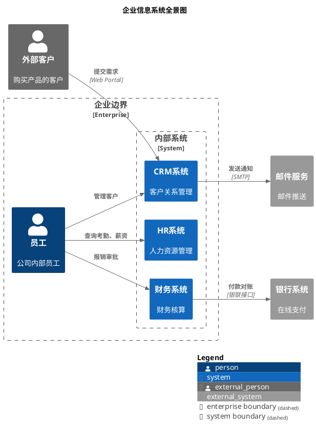

核心语法要点：
- 强制包裹: @startuml 和 @enduml（缺少会渲染失败）
- 强制库引用(最致命错误): !include <C4/C4_Context>，不能为空或错误
  * ❌ Kroki 不支持在线 URL include（安全限制）

元素定义：
- 人员: Person(alias, "名称", "描述", ?sprite, ?tags, ?link)
- 外部人员: Person_Ext(alias, "外部人员", "描述", ?sprite, ?tags, ?link)
- 系统: System(alias, "名称", "描述", ?sprite, ?tags, ?link, ?type)
- 外部系统: System_Ext(alias, "外部系统", "描述", ?sprite, ?tags, ?link, ?type)
- 数据库系统: SystemDb(alias, "数据库名", "描述", ?sprite, ?tags, ?link)
- 消息队列系统: SystemQueue(alias, "队列名", "描述", ?sprite, ?tags, ?link)

关系定义：
- 基础关系: Rel(from, to, "描述", ?技术)
- 反向关系: Rel_Back(from, to, "描述", ?技术)
- 方向关系: Rel_U/Rel_Up (上), Rel_D/Rel_Down (下), Rel_L/Rel_Left (左), Rel_R/Rel_Right (右)
- 双向关系: BiRel(from, to, "描述", ?技术)
- 方向双向: BiRel_U/BiRel_D/BiRel_L/BiRel_R

边界定义：
- 系统边界: System_Boundary(alias, "名称") { ... }
- 企业边界: Enterprise_Boundary(alias, "名称") { ... }
- 通用边界: Boundary(alias, "名称", ?type) { ... }

布局选项：
- 方向布局: LAYOUT_TOP_DOWN() / LAYOUT_LEFT_RIGHT() / LAYOUT_LANDSCAPE()
- 显示图例: SHOW_LEGEND()
- 组合使用: 先设置方向布局，再调用 SHOW_LEGEND()
- 手绘风格: LAYOUT_AS_SKETCH()

高级特性：
- 标签系统: $tags="tag1+tag2" 用于元素分类
- 自定义标签: AddElementTag(tagStereo, ?bgColor, ?fontColor, ?borderColor, ?shadowing, ?shape, ?sprite, ?techn, ?legendText, ?legendSprite, ?borderStyle, ?borderThickness)
- 自定义关系标签: AddRelTag(tagStereo, ?textColor, ?lineColor, ?lineStyle, ?sprite, ?techn, ?legendText, ?legendSprite)
- 添加链接: $link="https://example.com"
- 添加图标: $sprite="{SpriteName}" 或 img:{File/Url} 或 &{OpenIconic}

最佳实践：
- 粒度控制: 3-10个系统，过多应拆分为多个图
- 特殊字符: 描述中的[]{}()必须用双引号包裹
- 命名规范: alias使用驼峰命名或下划线，避免空格
- 技术标注: 使用第四个参数明确技术栈，如"HTTPS", "REST API"

## 常见错误
- 缺少@startuml/@enduml包裹
- !include路径错误或缺失
- alias重复定义
- 关系中的from/to引用不存在的alias


## 示例

### 示例 1



### 示例 2



### 示例 3

```plantuml
@startuml
!include <C4/C4_Context>
!include <awslib/AWSCommon>
!include <awslib/Storage/SimpleStorageServiceS3.puml>

title IoT平台系统上下文（带图标和标签）

AddElementTag("v1.0", $bgColor="#d4f1d4")
AddElementTag("legacy", $bgColor="#f1d4d4")
AddRelTag("async", $textColor="#ff6655", $lineColor="", $lineStyle="DashedLine")

Person(user, "设备用户", "操作IoT设备")
Person(ops, "运维人员", "监控系统健康")

System(iot_platform, "IoT平台", "设备管理和数据采集", $tags="v1.0")
System(device, "智能设备", "物联网终端", $sprite="robot", $tags="v1.0")
System_Ext(old_system, "遗留系统", "旧版监控平台", $tags="legacy")
SystemDb(timeseries, "时序数据库", "InfluxDB存储设备数据", $sprite="database")
SystemQueue(mq, "消息队列", "Kafka消息总线", $tags="v1.0")

Rel(user, device, "控制设备", "移动APP")
Rel(device, iot_platform, "上报数据", "MQTT", $tags="async")
Rel(iot_platform, timeseries, "存储时序数据", "HTTP API")
Rel(iot_platform, mq, "发布事件", "Kafka Protocol", $tags="async")
Rel(iot_platform, old_system, "数据同步", "REST API")
Rel(ops, iot_platform, "监控告警", "Web Console")

SHOW_LEGEND()
@enduml
```
