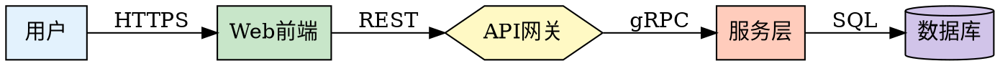
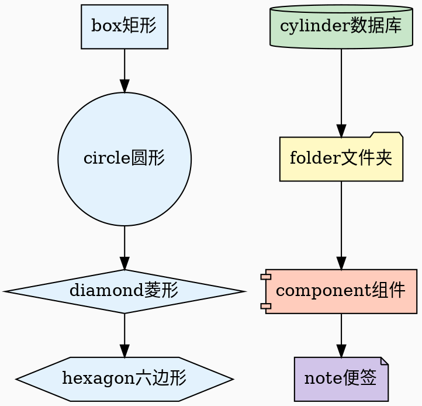
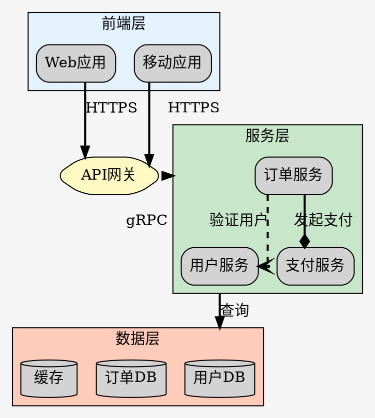
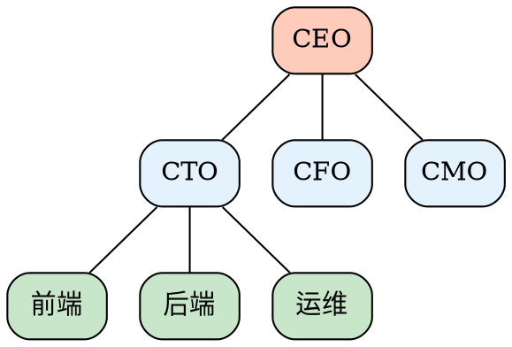

## 核心语法
- 图类型声明: digraph(有向图)或graph(无向图) + 图名{...}
- 节点定义: 节点ID [属性列表]，如A [label="开始", shape=circle]
- 边定义: 有向图用->，无向图用--，如A->B [label="连接"]
- 严格模式: strict graph/digraph 禁止多重边
- 注释: //单行注释, /* */多行注释, #开头行（C预处理器风格）

节点形状（基础）：
- 多边形: box矩形, circle圆形, ellipse椭圆, oval卵形, polygon多边形
- 几何: diamond菱形, triangle三角, invtriangle倒三角, trapezium梯形, invtrapezium倒梯形
- 特殊: hexagon六边形, septagon七边形, octagon八边形, pentagon五边形, star星形
- 数据: cylinder圆柱, egg蛋形, doublecircle双圆, doubleoctagon双八边形, tripleoctagon三重八边形
- 形状节点: larrow左箭头, rarrow右箭头, Mdiamond粗菱形, Msquare粗方形, Mcircle粗圆
- 记录: record记录, Mrecord圆角记录（支持|分隔字段）
- 文件: folder文件夹, tab标签页, note便签, box3d立方体
- 组件: component组件, assembly装配
- 生物学: promoter启动子, cds编码序列, terminator终止子, utr非翻译区, primersite引物位点, restrictionsite限制性位点, fivepoverhang五端突出, threepoverhang三端突出, noverhang无突出, signature签名, insulator绝缘子, ribosite核糖体位点, rnastab RNA稳定, proteasesite蛋白酶位点, proteinstab蛋白质稳定, rpromoter反向启动子, lpromoter左启动子
- 其他: house房子, invhouse倒房子, parallelogram平行四边形, underline下划线, plaintext纯文本, plain简单, rect矩形, rectangle矩形, square正方形, none无

节点属性：
- 标签: label="文本"（支持\n换行, \l左对齐, \r右对齐）
- 形状: shape=box/circle/diamond/hexagon等
- 样式: style=filled/dashed/dotted/bold/rounded/diagonals/striped
- 颜色: color="#333"边框色, fillcolor="#fff"填充色
- 字体: fontname="Arial", fontsize=14, fontcolor="#000"
- 尺寸: width=1.0, height=0.5（英寸）, fixedsize=true
- 位置: pos="x,y!"（neato引擎），group=组名（分组）
- 其他: tooltip="提示", URL="链接", penwidth=2.0边框宽度

边属性：
- 标签: label="文本", headlabel="头标签", taillabel="尾标签"
- 箭头形状: arrowhead=normal/vee/diamond/dot/none/tee/box/crow/curve/icurve/inv, arrowtail=同arrowhead
- 箭头方向: dir=forward/back/both/none
- 箭头大小: arrowsize=1.0（缩放因子）
- 线条样式: style=solid/dashed/dotted/bold/invis
- 线条颜色: color="#ff0000"
- 线条宽度: penwidth=2.0
- 权重: weight=5（影响布局）
- 约束: constraint=true/false（是否影响排序）
- 路径形状: splines=ortho/polyline/curved/line/none
- 标签装饰: decorate=true（标签跟随边）
- 其他: tooltip="提示", URL="链接", minlen=1最小长度

布局引擎（engine）：
- dot: 层次布局（默认），适合有向无环图、流程图
- neato: 弹簧布局，适合无向图、网络图
- fdp: 力导向布局，类似neato但使用不同算法
- circo: 环形布局，适合循环图、放射图
- twopi: 放射布局，从中心向外扩散
- sfdp: 大规模图布局，适合数千节点的图
- patchwork: 方块树图布局
- osage: 聚类布局，适合大型图

图布局属性（graph）：
- 方向: rankdir=TB/LR/BT/RL（上下/左右/下上/右左）
- 大小: size="宽,高"（英寸），ratio=fill/compress/auto
- 背景: bgcolor="#f5f5f5"
- 边距: margin=0.5（英寸）
- 间距: nodesep=0.5节点间距, ranksep=0.5层级间距
- 边形状: splines=ortho/polyline/curved/line/none
- 重叠: overlap=true/false/scale/scalexy（节点重叠处理）
- 聚类: compound=true（允许跨子图连接）
- 标签: label="图标题", labelloc=t/b, labeljust=l/r/c
- 其他: concentrate=true合并边, clusterrank=local/global

子图与聚类：
- 子图定义: subgraph 子图名 { ... }
- 聚类定义: subgraph cluster_名称 { ... }（cluster_前缀必需）
- 聚类属性: label="聚类名", color="#333", style=filled/dashed
- 跨聚类连接: 需设置compound=true, 使用lhead/ltail指向聚类
  * A -> B [lhead=cluster_target]（箭头指向聚类）
  * A -> B [ltail=cluster_source]（箭头从聚类出发）

## 高级语法
- 全局默认: graph[属性], node[属性], edge[属性]
- 记录节点: shape=record, label="字段1|字段2|{嵌套1|嵌套2}"
  * 语法字符: { } 嵌套分组，| 分隔字段，<port> 端口命名
  * 字面转义: 要显示字面的 { } | < > 字符时用 \{ \} \| \< \>
  * 端口命名: label="<port1>字段1|<port2>字段2"
- 端口连接: A:port1 -> B:port2（连接记录节点特定端口）
- 端口方位: A:n/ne/e/se/s/sw/w/nw/c/_（指定连接点方位）
- 同层对齐: {rank=same; A; B; C;}
- 层级设置: {rank=min/max/source/sink; A;}
- HTML标签: label=<<TABLE>...</TABLE>>（支持HTML表格，需合法XML）
- 样式组合: style="filled,rounded"
- 渐变色: fillcolor="#333333:#ffffff"（起始:结束）, gradientangle=90
- 边装饰: decorate=true（标签跟随边）
- 箭头修饰符:
  * o前缀: 开放式箭头（如obox, odiamond）
  * l/r前缀: 左/右半箭头（如ldiamond, rdiamond）
  * 组合: lteeoldiamond（从节点向外：左tee + 开放左diamond）

## DOT语言规则
- ID命名规则:
  * 字母（含扩展ASCII）/数字/下划线，不以数字开头
  * 数字常量: [-]?(.[0-9]+ | [0-9]+(.[0-9]*)?)
  * 双引号字符串: "包含空格或特殊字符"
  * HTML字符串: <...>（用于HTML-like标签）
  * 关键字作为ID需加引号
- 字符串转义: \n换行, \l左对齐换行, \r右对齐换行, \"双引号, \\反斜杠
- 记录节点字面转义: \{ \} \| \< \>（显示字面字符时使用）
- 字符串连接: "str1" + "str2"（仅适用双引号字符串，不适用HTML字符串）
- 分隔符: 分号;可选，逗号,分隔属性，空格分隔token
- 大小写: 关键字不区分大小写（graph=GRAPH=Graph）
- 注释: 支持 // 单行, /* */ 多行, # 行开头（C预处理器风格）

## Kroki 限制
- ✓ 完全支持所有标准节点形状和布局引擎
- ✓ 支持子图和cluster布局
- ⚠️ 节点数建议 ≤ 200（性能考虑）
- ⚠️ 复杂渐变在某些输出格式可能失真
- ❌ 不支持自定义字体（仅支持系统内置字体）

## 常见错误
- 节点ID包含特殊字符未加引号
  * ❌ my-node [label="test"]
  * ✓ "my-node" [label="test"]
- 子图cluster前缀缺失导致无边框
  * ❌ subgraph group1 {...}
  * ✓ subgraph cluster_group1 {...}
- 有向图误用无向图边语法
  * ❌ digraph G { A -- B; }
  * ✓ digraph G { A -> B; }
- 跨子图连接未设置compound
  * ❌ A -> B [lhead=cluster_X]
  * ✓ graph [compound=true]; A -> B [lhead=cluster_X]
- 记录节点端口连接语法错误
  * ❌ A->B:port1
  * ✓ A -> B:port1
- 记录节点字面字符未转义
  * ❌ [shape=record, label="显示{括号}文本"]（花括号会被解析为语法）
  * ✓ [shape=record, label="显示\{括号\}文本"]（正确显示字面花括号）
- HTML标签使用引号包裹
  * ❌ label="<TABLE>...</TABLE>"
  * ✓ label=<<TABLE>...</TABLE>>
- 混淆节点形状和箭头形状
  * 注意：larrow/rarrow 可以作为节点形状（shape=larrow）
  * inv 只能作为箭头形状（arrowhead=inv），不是节点形状

## 示例

### 示例 1

### 示例 2

### 示例 3

### 示例 4

```dot
digraph 数据库ER图 {
    rankdir=LR;
    node [shape=record, style=filled, fillcolor="#e8f5e9"];
    edge [arrowhead=crow];

    // 用户表
    User [label="{用户表 | id: INT\\l username: VARCHAR\\l email: VARCHAR\\l created_at: DATETIME\\l}"];

    // 订单表
    Order [label="{订单表 | id: INT\\l user_id: INT\\l amount: DECIMAL\\l status: ENUM\\l created_at: DATETIME\\l}"];

    // 商品表
    Product [label="{商品表 | id: INT\\l name: VARCHAR\\l price: DECIMAL\\l stock: INT\\l}"];

    // 订单明细表
    OrderItem [label="{订单明细 | id: INT\\l order_id: INT\\l product_id: INT\\l quantity: INT\\l}"];

    // 关系
    User -> Order [label="1:N", dir=both, arrowtail=none, arrowhead=crow];
    Order -> OrderItem [label="1:N", dir=both, arrowtail=none, arrowhead=crow];
    Product -> OrderItem [label="1:N", dir=both, arrowtail=none, arrowhead=crow];
}
```

### 示例 5

