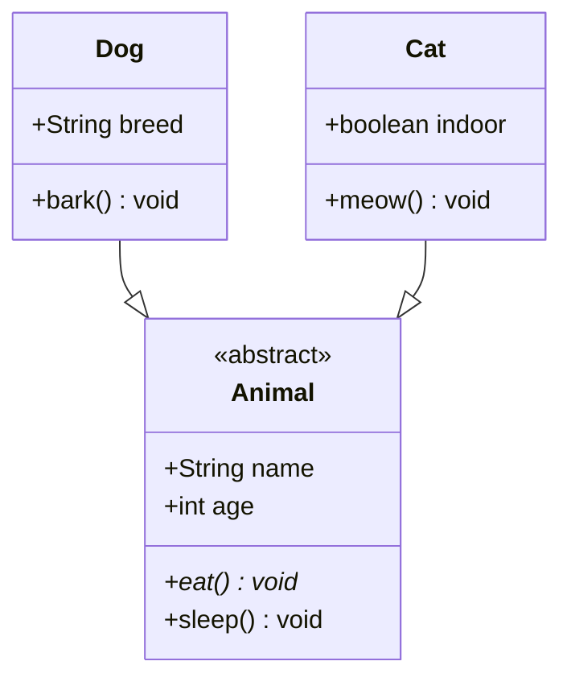
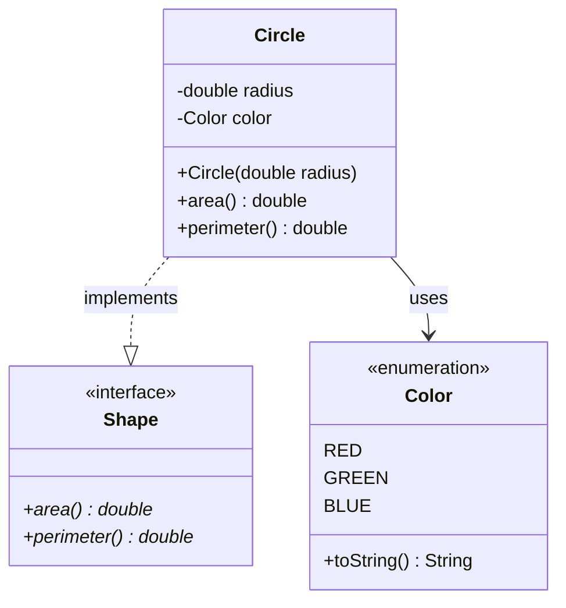
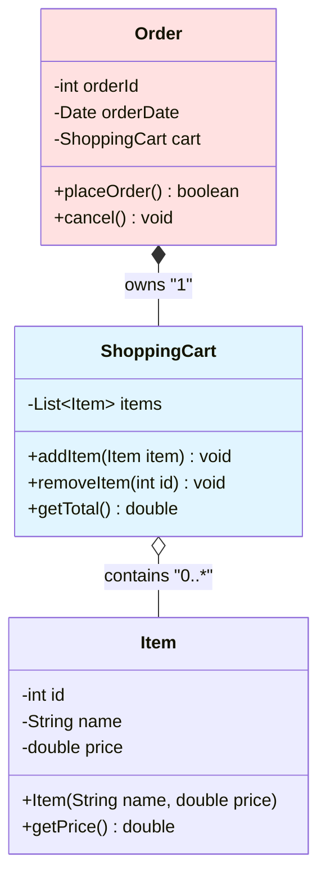

## 核心语法
- 声明: classDiagram

- 类定义:
  * class 类名 { ... } - 标准类
  * 类名内部定义属性和方法

- 可见性修饰符:
  * + public（公开）
  * - private（私有）
  * # protected（受保护）
  * ~ package（包级别）

- 属性语法:
  * 格式: 可见性 类型 名称
  * 示例: +String name

- 方法语法:
  * 格式: 可见性 方法名(参数类型 参数名) 返回类型
  * 示例: +getName() String
  * 静态方法: 方法后加 $ 标记
  * 抽象方法: 方法后加 * 标记
  * 示例: +getInstance()$ MyClass
  * 示例: +calculate()* void

- 关系符号:
  * --|> 继承（实线三角箭头，子类→父类）
  * ..|> 实现（虚线三角箭头，实现类→接口）
  * *-- 组合（实心菱形，整体→部分，生命周期绑定）
  * o-- 聚合（空心菱形，整体→部分，生命周期独立）
  * --> 关联（实线箭头）
  * ..> 依赖（虚线箭头）

- 关系方向:
  * 继承/实现: 子类→父类
  * 组合/聚合: 整体→部分
  * 关联/依赖: 根据语义

- 泛型:
  * 使用 ~T~ 表示（不是 <T>）
  * 示例: List~T~
  * 示例: Map~K,V~

- 注解:
  * <<interface>> - 接口
  * <<abstract>> - 抽象类
  * <<enumeration>> - 枚举
  * 放在类名下方第一行

- 多重性:
  * 用引号包裹: "1", "*", "0..1", "1..*", "0..*"
  * 放在关系箭头附近

- 类约束:
  * 每个类至少有一个属性或方法

## 高级语法
- 枚举类:
  * 使用 <<enumeration>> 注解
  * 枚举值作为属性列出（无可见性修饰符）
  * 示例:
    class Color {
        <<enumeration>>
        RED
        GREEN
        BLUE
    }

- 构造函数:
  * 与类名同名的方法即构造函数
  * 无返回类型
  * 示例: +User(String name, int age)

- 抽象方法标记:
  * 方法名后添加 * 标记
  * 必须在抽象类或接口中
  * 示例: +calculate()* void

- 关系标签:
  * 在关系箭头后添加冒号和标签
  * 示例: Dog --|> Animal : extends
  * 示例: Circle --> Color : uses

- 命名空间:
  * namespace 命名空间名 { ... }
  * 用于分组相关类

## Kroki 限制
- ✓ 完全支持 <<enumeration>>
- ✓ 支持构造函数标记
- ✓ 支持抽象方法 * 标记
- ✓ 支持泛型 ~T~ 语法
- ⚠️ 类数量建议 ≤15 个
- ⚠️ 避免过多继承层级（≤5 层）

常见错误排查：
1. 枚举类格式错误
   ❌ +RED, +GREEN（枚举值不需要可见性）
   ✓ RED
      GREEN
      BLUE

2. 构造函数返回类型
   ❌ +User() User（不应有返回类型）
   ✓ +User(String name)

3. 抽象标记位置错误
   ❌ *calculate() void
   ✓ +calculate()* void

4. 泛型语法错误
   ❌ List<T>
   ✓ List~T~

5. 关系方向错误
   ❌ Animal --|> Dog（父类→子类错误）
   ✓ Dog --|> Animal（子类→父类正确）

## 示例

### 示例 1

### 示例 2

### 示例 3

