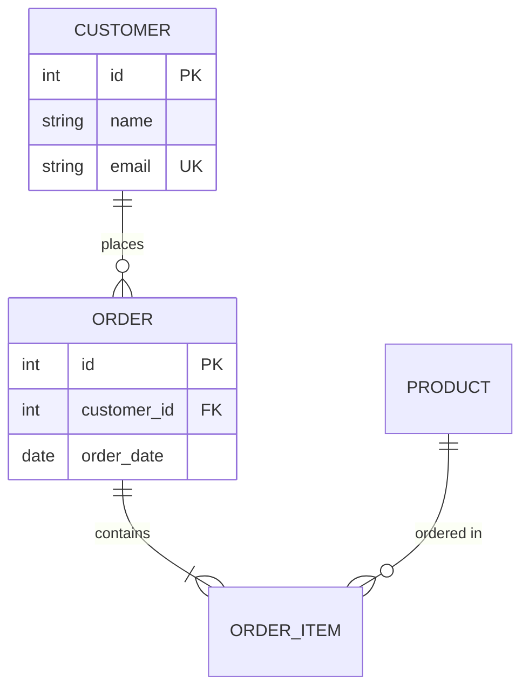

## 核心语法
- 声明: erDiagram

- 实体命名:
  * 推荐大写: CUSTOMER, ORDER, PRODUCT
  * 保持一致性
  * 使用下划线分隔: ORDER_ITEM

- 属性定义:
  * 格式: 类型 名称 约束 "注释"
  * 示例: int id PK "主键ID"
  * 示例: string email UK "唯一邮箱"

- 数据类型:
  * int - 整数
  * string - 字符串
  * varchar - 可变长字符串
  * date - 日期
  * datetime - 日期时间
  * boolean - 布尔值
  * decimal - 小数
  * text - 文本

- 约束关键字:
  * PK - 主键（Primary Key）
  * FK - 外键（Foreign Key）
  * UK - 唯一键（Unique Key）
  * NN - 非空（Not Null）
  * 可组合: PK,NN

- 关系基数符号:
  * | 表示"仅一个"（内侧符号）
  * o 表示"零"（内侧符号）
  * } 表示"多个"（外侧符号）

- 基数组合:
  * || - 有且仅有一（1）
  * |o - 零或一（0..1）
  * }| - 一或多（1..N）
  * }o - 零或多（0..N）

- 基数别名（可选）:
  * one or zero 等同于 |o
  * zero or one 等同于 |o
  * one or more 等同于 }|
  * one or many 等同于 }|
  * many(1) 等同于 }|
  * 1+ 等同于 }|
  * zero or more 等同于 }o
  * zero or many 等同于 }o
  * many(0) 等同于 }o
  * 0+ 等同于 }o
  * only one 等同于 ||
  * 1 等同于 ||

- 关系语法:
  * 格式: 实体1 左基数关系符右基数 实体2 : "关系名"
  * 实线: -- 识别关系（identifying，子实体依赖父实体存在）
  * 虚线: .. 非识别关系（non-identifying，实体可独立存在）
  * 别名: to 等同于 --, optionally to 等同于 ..

- 常见关系类型:
  * 一对一: ||--||
  * 一对多: ||--o{
  * 多对多: }o--o{（需要中间表）
  * 可选一对多: ||..o{

- 约束规则:
  * 每个实体必须至少有一个 PK 主键
  * 避免空实体定义（至少有一个属性）
  * 外键应指向有效的主键

## 高级语法
- 属性注释:
  * 使用双引号包裹
  * 简洁描述属性用途
  * 示例: string name NN "用户姓名"

- 复合主键:
  * 多个属性标记为 PK
  * 示例:
    ENROLLMENT {
        int student_id PK,FK
        int course_id PK,FK
    }

- 关系标签:
  * 使用有意义的动词
  * 示例: places（下单）, contains（包含）, belongs to（属于）

- 自引用关系:
  * 实体指向自身
  * 示例: EMPLOYEE ||--o{ EMPLOYEE : manages

## 设计建议
- 实体数量: 5-20 个为佳
- 属性数量: 每个实体 3-15 个属性
- 避免冗余: 通过外键关联，不重复存储
- 规范化: 至少达到第三范式（3NF）

## Kroki 限制
- ✓ 完全支持所有基数符号
- ✓ 支持实线和虚线关系
- ✓ 支持约束：PK, FK, UK
- ❌ 不支持 NN 约束：会报 "Parse error"
- ❌ 不支持多个约束组合（如 PK,NN, UK,NN）：逗号语法不被识别
- ⚠️ 实体建议 ≤30 个
- ⚠️ 关系建议 ≤50 条

常见错误排查：
1. 注释语法错误
   ❌ // 这是注释（错误：Mermaid 不支持 //）
   ❌ # 这是注释（错误：Mermaid 不支持 #）
   ✓ %% 这是注释

2. 缺少主键
   ❌ CUSTOMER {
          string name
      }
   ✓ CUSTOMER {
          int id PK
          string name
      }

2. 基数符号错误
   ❌ CUSTOMER |-->| ORDER
   ✓ CUSTOMER ||--o{ ORDER

3. 多对多未使用中间表
   ❌ STUDENT }o--o{ COURSE
   ✓ STUDENT ||--o{ ENROLLMENT : enrolls
      COURSE ||--o{ ENROLLMENT : has
      ENROLLMENT {
          int student_id PK,FK
          int course_id PK,FK
      }

4. 外键无约束标记
   ❌ ORDER {
          int customer_id
      }
   ✓ ORDER {
          int customer_id FK
      }


## 示例

### 示例 1



### 示例 2

```mermaid
erDiagram
    USER ||--o{ POST : creates
    POST ||--o{ COMMENT : has
    USER ||--o{ COMMENT : writes
    POST }o--o{ TAG : tagged

    USER {
        int user_id PK
        string username UK,NN "用户名"
        string email UK,NN "邮箱"
        datetime created_at NN "创建时间"
    }

    POST {
        int post_id PK
        int user_id FK
        string title NN "标题"
        text content NN "内容"
        datetime published_at "发布时间"
    }

    COMMENT {
        int comment_id PK
        int post_id FK
        int user_id FK
        text content NN "评论内容"
        datetime created_at NN "创建时间"
    }

    TAG {
        int tag_id PK
        string name UK,NN "标签名"
    }
```

### 示例 3

```mermaid
erDiagram
    DEPARTMENT ||--o{ EMPLOYEE : employs
    EMPLOYEE ||--o{ EMPLOYEE : manages
    EMPLOYEE ||--o{ PROJECT_ASSIGNMENT : assigned
    PROJECT ||--o{ PROJECT_ASSIGNMENT : has

    DEPARTMENT {
        int dept_id PK
        string dept_name UK,NN
        string location
    }

    EMPLOYEE {
        int emp_id PK
        int dept_id FK
        int manager_id FK
        string name NN
        string email UK
        decimal salary
    }

    PROJECT {
        int project_id PK
        string project_name NN
        date start_date
        date end_date
    }

    PROJECT_ASSIGNMENT {
        int emp_id PK,FK
        int project_id PK,FK
        date assigned_date NN
        string role
    }
```
