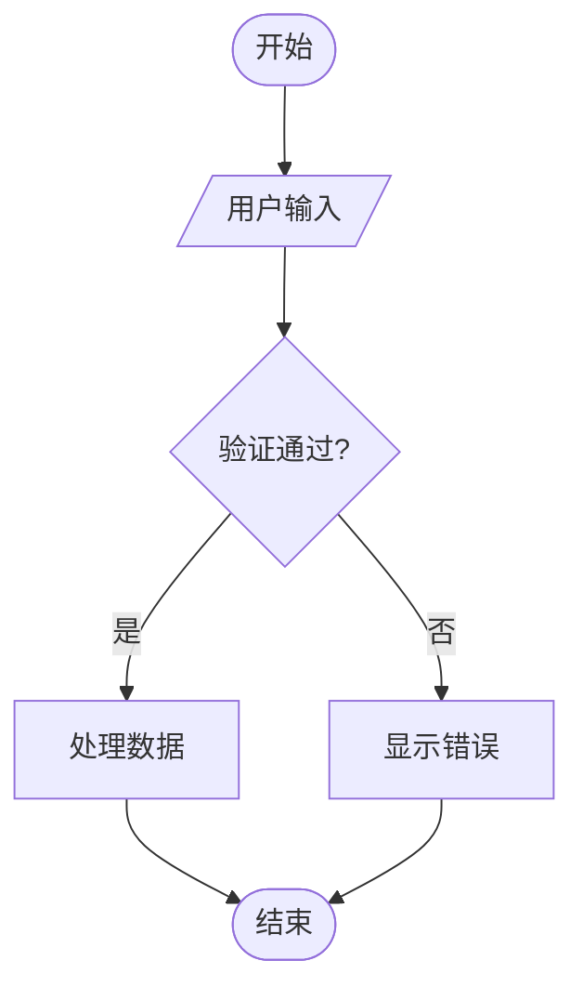
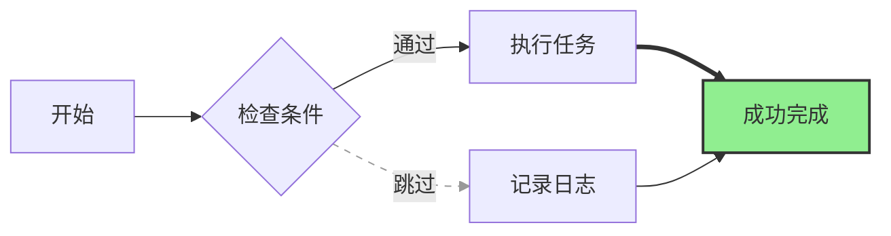
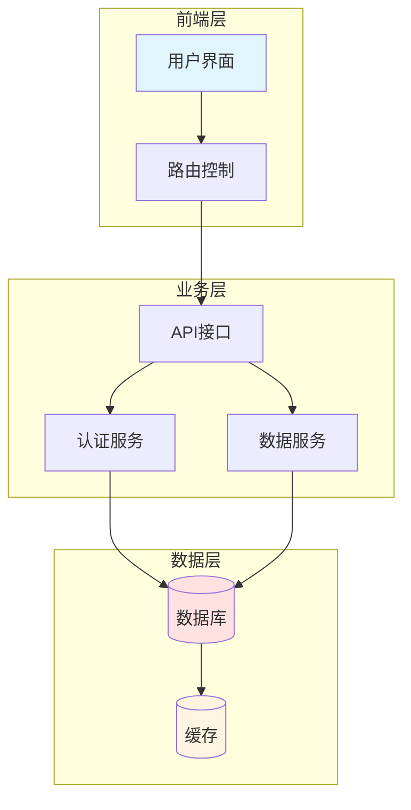

## 核心语法
- 声明: flowchart TD/LR/BT/RL (方向：上下/左右/下上/右左)
  * TD (Top Down): 从上到下，适合垂直流程
  * LR (Left to Right): 从左到右，适合时间线/阶段展示
  * BT (Bottom to Top): 从下到上，适合逆向追溯
  * RL (Right to Left): 从右到左，适合特殊场景

- 节点形状语法:
  * [文本] - 矩形，表示操作/处理步骤
  * {文本} - 菱形，表示判断/条件分支
  * (文本) - 圆角矩形，表示开始/结束
  * ((文本)) - 圆形，表示连接点
  * [/文本/] - 平行四边形（右倾），表示输入
  * [\文本\] - 平行四边形（左倾），表示输出
  * [(文本)] - 圆柱形，表示数据库
  * [[文本]] - 子程序形状
  * {{文本}} - 六边形，表示条件准备
  * [/文本\] - 梯形，表示人工操作
  * [\文本/] - 反梯形，表示优先动作

- 连接箭头语法:
  * --> 实线箭头（主流程）
  * -.-> 虚线箭头（可选/辅助流程）
  * ==> 粗箭头（强调/关键路径）
  * --- 实线无箭头
  * -.- 虚线无箭头
  * -->|标签| 带标签的箭头
  * A-->B-->C 链式连接多步骤

- 决策节点规则:
  * 必须使用菱形 {条件}
  * 必须有 ≥2 个分支
  * 每个分支用 |标签| 标注判断结果
  * 示例: B{是否通过} -->|是| C[执行]
           B -->|否| D[拒绝]

- 子图嵌套:
  * 语法: subgraph 标题 ... end
  * 最大层级 ≤3 层（Kroki 限制）
  * 子图内可包含节点和连接
  * 示例:
    subgraph 子系统A
        A1-->A2
    end

- 保留字禁用:
  * 禁止使用: end, subgraph, direction, graph, style, class, click
  * 常见错误: end[结束] ❌
  * 正确写法: finish[结束] ✓

- 流程完整性检查:
  * 所有路径必须有终点
  * 无悬空分支
  * 循环必须有退出条件

## 高级语法
- 节点样式定义:
  * 语法: style 节点ID fill:#颜色,stroke:#边框颜色,stroke-width:粗细px
  * 示例: style A fill:#f9f,stroke:#333,stroke-width:2px
  * 颜色格式: 支持 #RGB, #RRGGBB, 颜色名（red, blue）

- CSS 类定义:
  * 定义类: classDef 类名 样式属性
  * 应用类: class 节点ID 类名
  * 批量应用: class A,B,C 类名
  * 示例:
    classDef success fill:#90EE90,stroke:#333,stroke-width:2px
    class E success

- 链接样式:
  * 语法: linkStyle 链接索引 stroke:#颜色,stroke-width:粗细px
  * 链接索引从 0 开始，按代码顺序计数
  * 虚线效果: linkStyle 0 stroke:#999,stroke-dasharray:5
  * 示例: linkStyle 0 stroke:#ff3,stroke-width:4px

- 注释和文档:
  * 单行注释: %% 这是注释
  * 注释不会在渲染图表中显示

## Kroki 限制
- ✓ 支持基础样式和类定义
- ✓ 支持虚线和粗线连接
- ✓ 支持子图嵌套（≤3 层）
- ❌ 不支持节点文本中的特殊字符转义：`< > & " '` 会导致 "Parse error"
- ⚠️ 节点数建议 ≤100
- ⚠️ 嵌套层级 ≤3
- ⚠️ 避免过深的链式调用（>10 步）

常见错误排查：
1. 注释语法错误
   ❌ // 这是注释（错误：Mermaid 不支持 //）
   ❌ # 这是注释（错误：Mermaid 不支持 #）
   ✓ %% 这是注释

2. 使用保留字作节点 ID
   ❌ end[结束]
   ✓ finish[结束]

3. 虚线语法错误
   ❌ ---> (三个短横线)
   ✓ -.-> (点-短横-点-箭头)

4. 样式语法错误
   ❌ style A {fill:#f9f}
   ✓ style A fill:#f9f,stroke:#333

5. 标签引号缺失
   ❌ -->带空格的标签|
   ✓ -->|带空格的标签|

6. 子图未闭合
   ❌ subgraph 标题 ... (缺少 end)
   ✓ subgraph 标题 ... end

## 示例

### 示例 1

### 示例 2

### 示例 3

