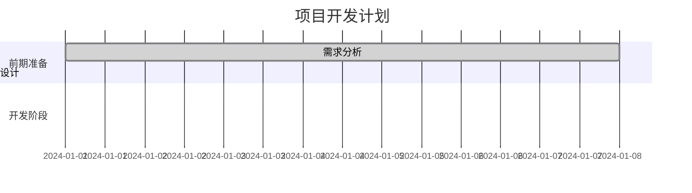
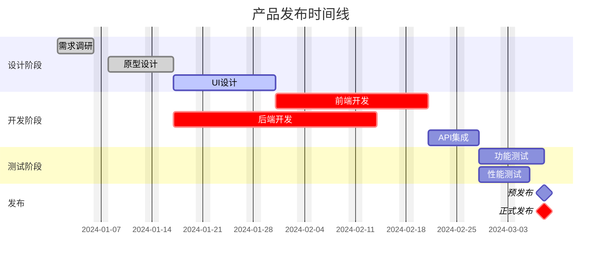
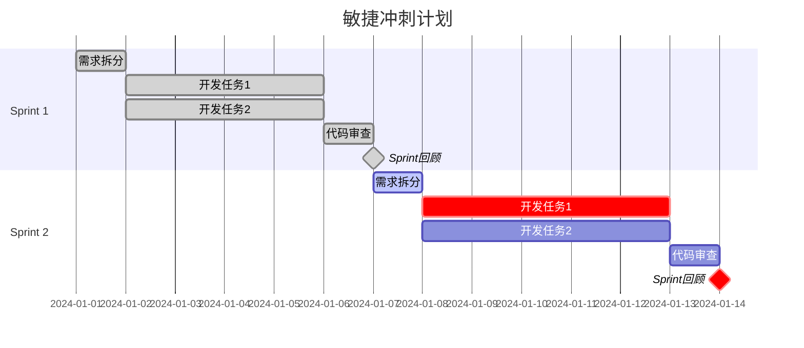

## 核心语法
- 声明: gantt
- 标题（可选）: title 项目计划

- 日期格式声明:
  * dateFormat YYYY-MM-DD（推荐 ISO 8601）
  * 必须在任务定义之前声明
  * 致命错误: 日期格式与 dateFormat 不一致会编译失败

- 任务格式:
  * 基本格式: 任务名称 : 开始日期, 持续时间
  * 完整格式: 任务名称 : 状态, 任务ID, 开始日期, 持续时间
  * 示例: 需求分析 : done, task1, 2024-01-01, 7d

- 任务状态:
  * done - 已完成
  * active - 进行中
  * crit - 关键任务
  * 不写 - 未开始
  * 可组合: done, crit

- 时间单位:
  * d - 天（如 7d）
  * h - 小时（如 24h）
  * m - 分钟（如 120m）
  * w - 周（如 2w）
  * 数字和单位间无空格

- 里程碑:
  * 关键字: milestone
  * 持续时间必须为 0d
  * 格式: 任务名称 : milestone, 日期, 0d
  * 示例: 项目上线 : milestone, crit, 2024-12-31, 0d

- 任务依赖:
  * 语法: after 任务ID
  * 单依赖: after task1
  * 多依赖: after task1 task2 task3
  * 依赖的任务必须先定义

- 分组（section）:
  * 语法: section 阶段名称
  * 后续任务属于该分组
  * 可以有多个 section

- 排除日期:
  * excludes weekends - 排除周末
  * excludes YYYY-MM-DD - 排除特定日期
  * 可多次使用

## 高级语法
- 今日标记:
  * todayMarker off - 关闭今日标记
  * todayMarker stroke-width:5px - 自定义标记样式

- 任务点击事件:
  * 语法: click 任务ID href "URL"
  * 示例: click task1 href "https://example.com"

- 坐标轴格式:
  * axisFormat %Y-%m-%d - 自定义日期显示格式
  * axisFormat %m/%d - 简化日期格式

## 时间计算规则
- 起始日期 + 持续时间 = 结束日期
- 依赖任务在前置任务完成后开始
- 周末和排除日期不计入工作日

## 设计建议
- 任务数量: 10-30 个为佳
- 时间跨度: 1 个月到 1 年
- 分组: 3-7 个阶段
- 里程碑: 5-10 个关键节点
- 依赖链: 避免过长（≤5 层）

## Kroki 限制
- ✓ 完全支持所有任务状态
- ✓ 支持任务依赖
- ✓ 支持里程碑
- ⚠️ 任务建议 ≤50 个
- ⚠️ 时间跨度建议 ≤2 年

常见错误排查：
1. 日期格式不一致
   ❌ dateFormat YYYY-MM-DD
      任务 : 2024/01/01, 7d
   ✓ dateFormat YYYY-MM-DD
      任务 : 2024-01-01, 7d

2. 里程碑持续时间非零
   ❌ 上线 : milestone, 2024-12-31, 1d
   ✓ 上线 : milestone, 2024-12-31, 0d

3. 时间单位有空格
   ❌ 任务 : 2024-01-01, 7 d
   ✓ 任务 : 2024-01-01, 7d

4. 依赖任务未定义
   ❌ 任务B : after task1, 5d（task1 未定义）
   ✓ 任务A : task1, 2024-01-01, 3d
      任务B : after task1, 5d

5. section 拼写错误
   ❌ Section 阶段1
   ✓ section 阶段1

## 示例

### 示例 1

### 示例 2

### 示例 3

