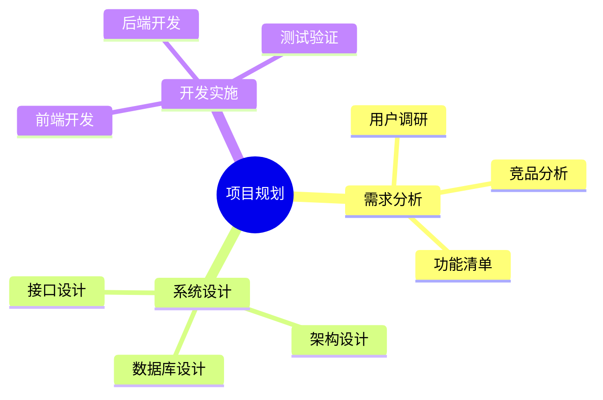
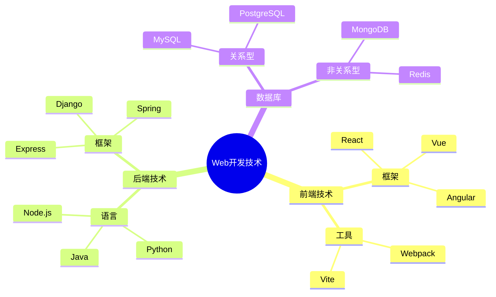
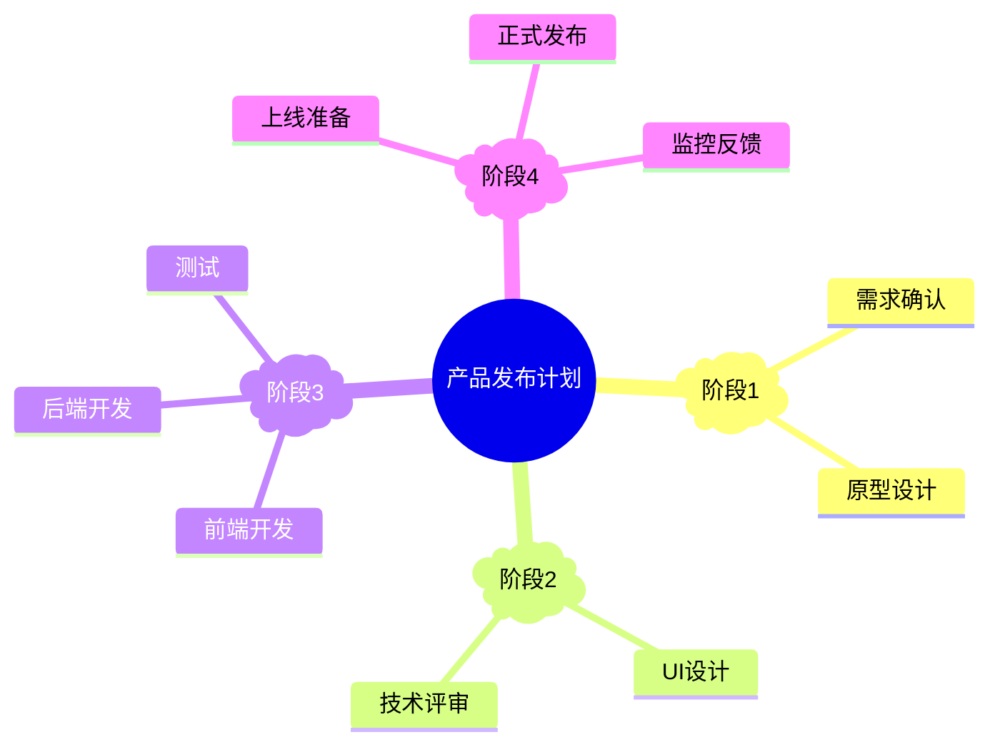

## 核心语法
- 声明:
  * 语法: mindmap
  * 紧跟根节点

- 根节点:
  * 每个思维导图只有一个根节点
  * 使用形状包裹
  * 示例: root((项目规划))

- 层级缩进:
  * 每层级 +2 个空格（禁用 Tab）
  * 建议最大层级 ≤4 层
  * 同级节点空格数必须完全一致

- 节点形状:
  * ((文本)) - 圆形（通常用于根节点）
  * (文本) - 圆角矩形
  * [文本] - 矩形
  * )文本( - 云形
  * ))文本(( - 爆炸形
  * {{文本}} - 六边形
  * 不加形状 - 默认矩形

- 节点文本:
  * 长度 ≤20 个中文字符
  * 使用关键词，不用完整句子
  * 简洁明了

- 图标（可选）:
  * 语法: ::icon(fa fa-tasks)
  * 使用 Font Awesome 图标
  * 放在节点文本后

## 层级结构规则
- 根节点: 1 个
- 一级子节点: 3-7 个（最佳）
- 二级子节点: 每个一级下 2-5 个
- 避免单子节点（孤立分支）

- 缩进一致性:
  * 同级节点空格数必须完全一致
  * ❌ 缩进混乱会导致解析失败
  * ✓ 使用编辑器的空格可视化功能

## 分支平衡建议
- 避免某分支过大（>其他分支总和）
- 避免某分支过小（只 1 个子节点）
- 同级节点数 ≤7 个（符合认知规律）
- 深度和广度平衡

## 设计原则
- 中心主题明确
- 分支逻辑清晰
- 关键词精炼
- 层级适中（3-4 层）
- 视觉平衡

## 典型应用场景
- 知识体系: 学科知识、技术栈
- 项目规划: 任务分解、里程碑
- 头脑风暴: 创意收集、方案对比
- 会议笔记: 要点梳理、行动项
- 学习笔记: 章节总结、概念关系

## Kroki 限制
- ✓ 支持所有节点形状
- ✓ 支持图标（Font Awesome）
- ⚠️ 总节点建议 ≤50 个
- ⚠️ 层级建议 ≤5 层
- ⚠️ 节点文本 ≤30 字符

常见错误排查：
1. 缩进不一致
   ❌ mindmap
        root((中心))
          节点A
           节点B
   ✓ mindmap
        root((中心))
          节点A
          节点B

2. 使用 Tab 缩进
   ❌ 使用 Tab 键缩进
   ✓ 使用 2 个空格缩进

3. 根节点多个
   ❌ mindmap
        root1((中心1))
        root2((中心2))
   ✓ mindmap
        root((中心))
          分支1
          分支2

4. 节点形状不匹配
   ❌ (文本))（左右括号不匹配）
   ✓ (文本)

5. 层级过深
   ❌ 6-7 层嵌套
   ✓ 3-4 层嵌套

## 示例

### 示例 1

### 示例 2

### 示例 3

