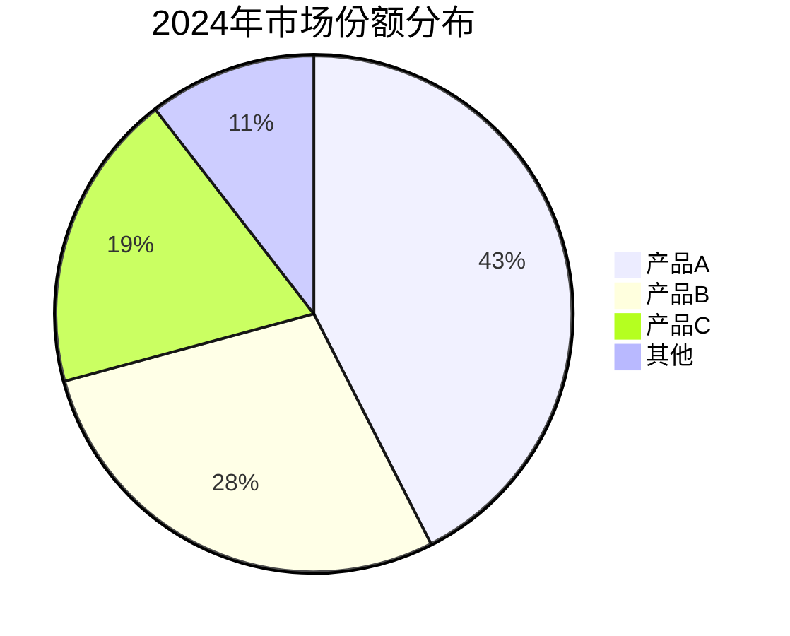
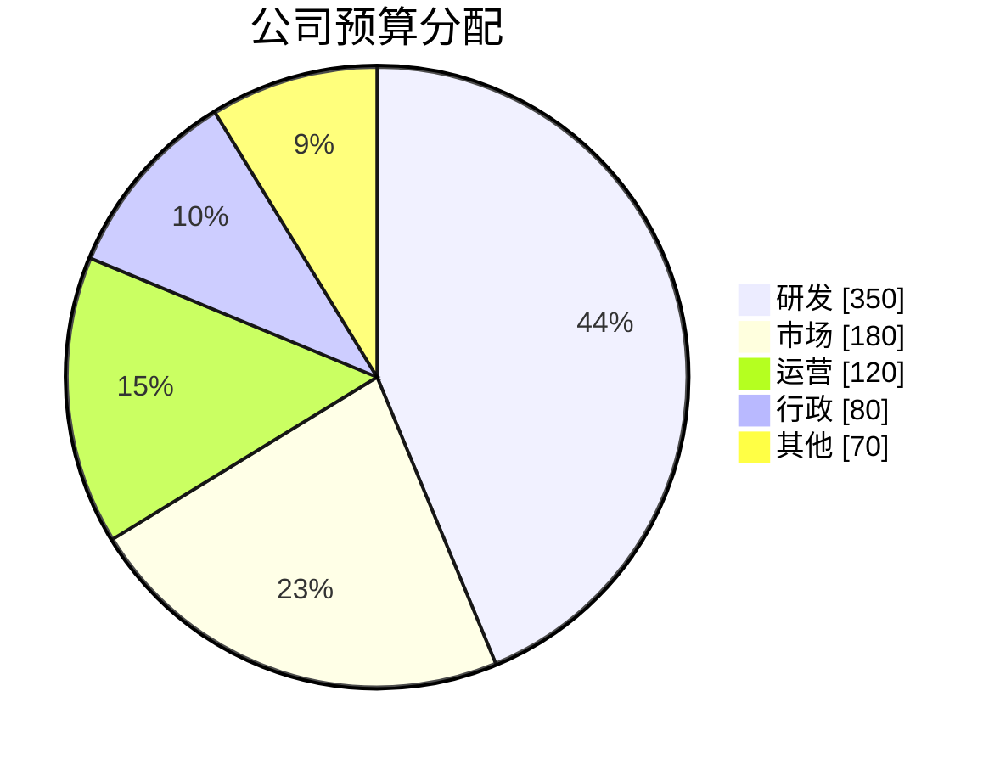
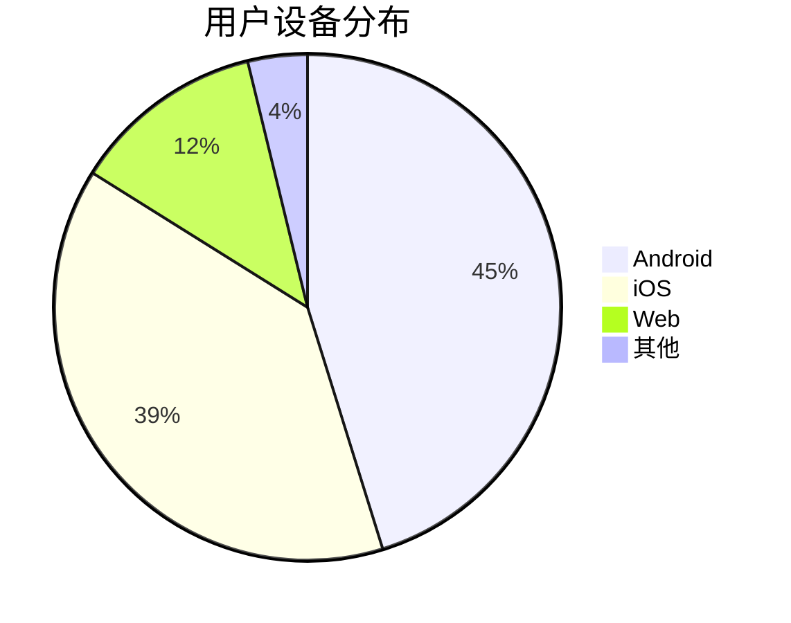

## 核心语法
- 声明:
  * pie - 基础饼图
  * pie showData - 显示具体数值的饼图

- 标题（可选）:
  * 语法: title 图表标题
  * 示例: title 2024年市场份额分布

- 数据格式:
  * 格式: "标签" : 数值
  * 每行一项
  * 示例: "产品A" : 42.5

- 标签规则:
  * 必须用双引号包裹
  * 长度 ≤15 个中文字符
  * 不能重复
  * 支持中文、英文、数字

- 数值规则:
  * 必须为正数
  * 支持整数和小数
  * 自动计算百分比
  * 无需手动计算比例

- 数据项数量:
  * 最少 2 个
  * 建议 3-7 个（最佳可读性）
  * 最多 ≤10 个

## 高级规则
- 比例平衡:
  * 避免所有扇区相近（差异 <5%）
  * 避免过大扇区（>90%）
  * 小比例项（<5%）考虑合并为"其他"

- 数据排序:
  * 建议从大到小排序
  * 或按业务逻辑排序
  * 保持一致性

- 颜色分配:
  * Mermaid 自动分配颜色
  * 默认使用主题配色
  * 无需手动指定颜色

## 设计建议
- 数据完整性: 数据总和应有实际意义
- 标签清晰: 使用简短、明确的标签
- 数据准确: 确保数值正确，无遗漏
- 可读性: 避免过多小扇区（<3%）

## 典型场景
- 市场份额: 各产品/公司占比
- 资源分配: 预算、人力分布
- 调查结果: 投票、问卷统计
- 业务占比: 收入来源、用户分布

## Kroki 限制
- ✓ 完全支持 showData 模式
- ✓ 自动计算百分比
- ⚠️ 数据项建议 ≤10 个
- ⚠️ 标签长度 ≤20 字符

常见错误排查：
1. 标签未使用引号
   ❌ 产品A : 42.5
   ✓ "产品A" : 42.5

2. 标签重复
   ❌ "产品A" : 30
      "产品A" : 20
   ✓ "产品A" : 30
      "产品B" : 20

3. 数值为负数
   ❌ "亏损" : -10
   ✓ "盈利" : 90
      "其他" : 10

4. 数据项过少
   ❌ "唯一项" : 100
   ✓ "项目A" : 60
      "项目B" : 40

5. showData 拼写错误
   ❌ pie showdata
   ✓ pie showData

## 示例

### 示例 1

### 示例 2

### 示例 3

