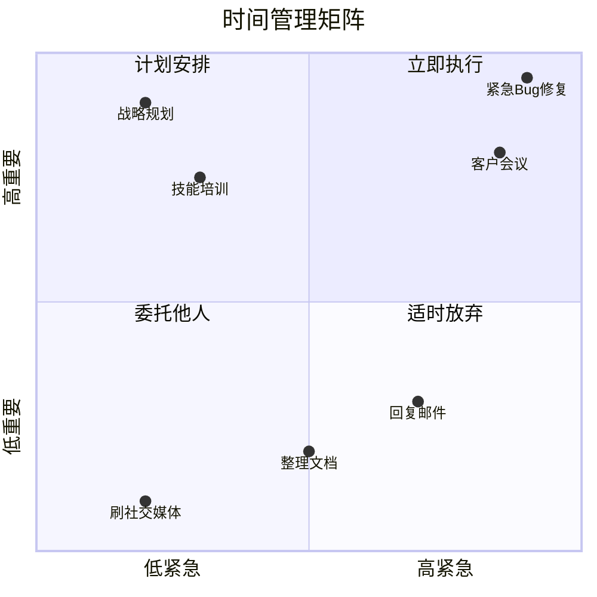
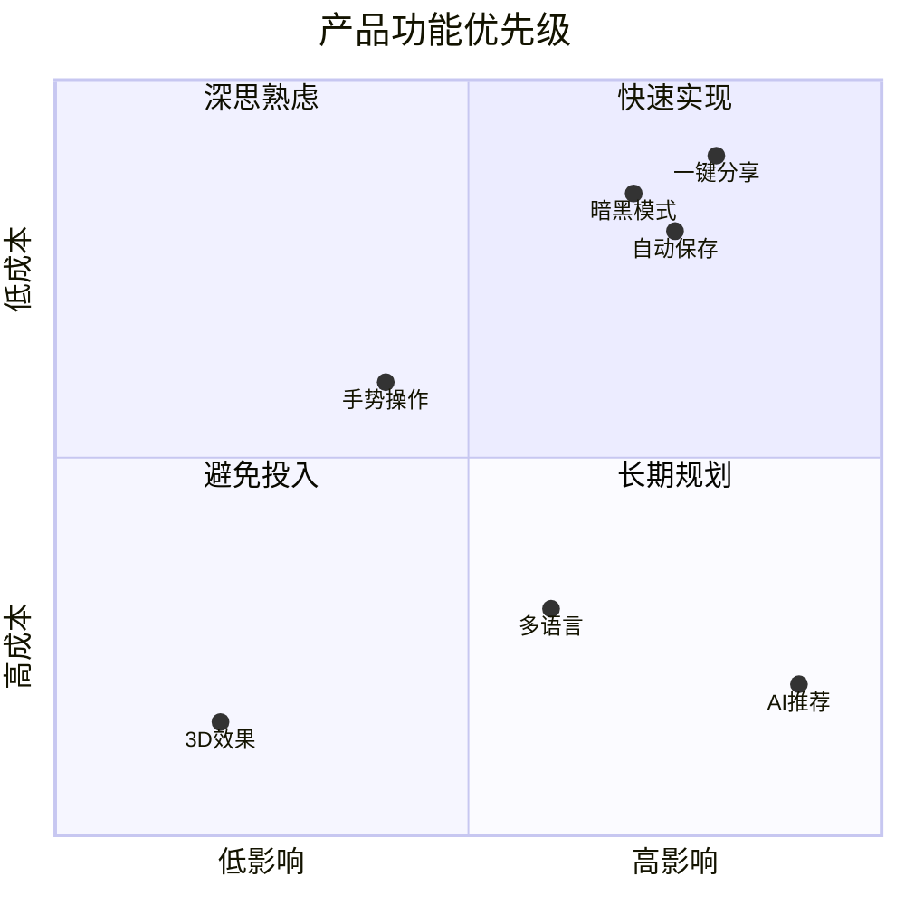
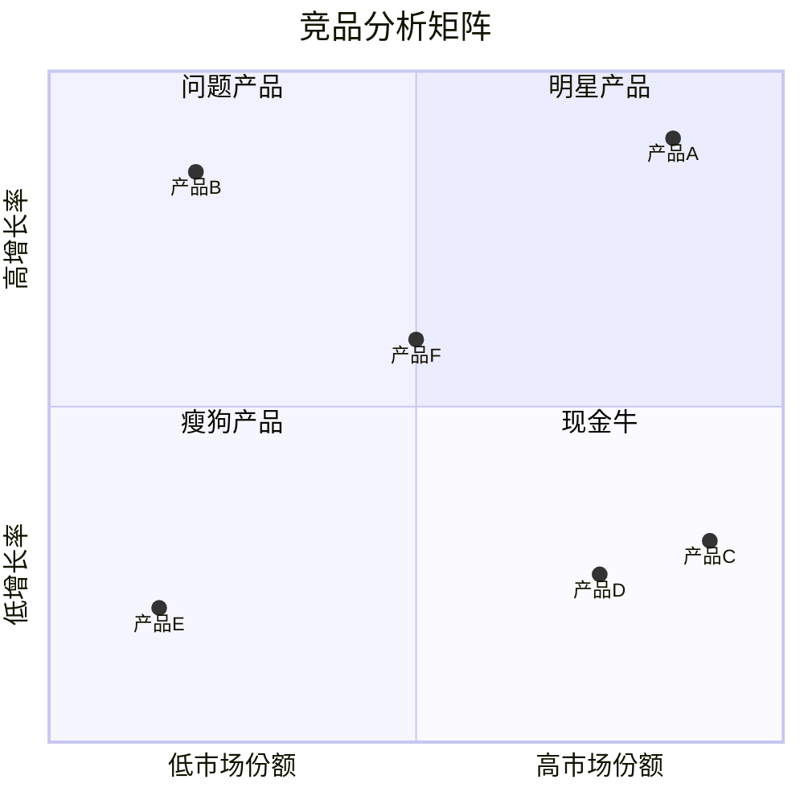

## 核心语法
- 声明: quadrantChart 开头

- 标题:
  * title 标题文本

- 坐标轴定义:
  * x-axis 左侧标签 --> 右侧标签
  * y-axis 下方标签 --> 上方标签
  * 示例: x-axis 低紧急 --> 高紧急
  * 示例: y-axis 低重要 --> 高重要

- 象限标签（从右上角逆时针）:
  * quadrant-1 第一象限名称（右上）
  * quadrant-2 第二象限名称（左上）
  * quadrant-3 第三象限名称（左下）
  * quadrant-4 第四象限名称（右下）
  * 示例: quadrant-1 立即执行
  * 示例: quadrant-2 计划安排
  * 示例: quadrant-3 委托他人
  * 示例: quadrant-4 适时放弃

- 数据点:
  * 数据名称: [x坐标, y坐标]
  * 坐标范围: 0.0 到 1.0
  * 示例: 任务A: [0.8, 0.9]
  * 示例: 任务B: [0.2, 0.3]

- 注释语法:
  * %% 注释内容

## 高级语法
- 样式配置:
  * %%{init: {"quadrantChart": {...}}}%%

- 可配置属性:
  * chartWidth: 图表宽度
  * chartHeight: 图表高度
  * titleFontSize: 标题字号
  * titlePadding: 标题边距
  * quadrantPadding: 象限边距
  * xAxisLabelFontSize: X轴标签字号
  * yAxisLabelFontSize: Y轴标签字号
  * quadrantLabelFontSize: 象限标签字号
  * pointTextPadding: 点标签边距
  * pointLabelFontSize: 点标签字号
  * pointRadius: 数据点半径

- 主题配置:
  * %%{init: {'theme': 'forest'}}%%

## 设计建议
- 数据点数量: 5-15 个为佳
- 坐标轴标签: 简洁明了（2-6 字）
- 象限标签: 动作导向（如"立即执行"）
- 数据点名称: 简短标识（2-10 字）
- 避免数据点过于密集

## Kroki 限制
- ✓ 支持基础象限图语法
- ✓ 支持坐标轴和象限标签
- ✓ 支持多数据点
- ✓ 支持样式配置
- ⚠️ 数据点建议 ≤20 个
- ⚠️ 名称长度建议 ≤15 字

常见错误排查：
1. 注释语法错误
   ❌ // 这是注释
   ❌ # 这是注释
   ✓ %% 这是注释

2. 坐标范围错误
   ❌ 任务A: [1.5, 0.8]（超出 0-1 范围）
   ✓ 任务A: [0.8, 0.9]

3. 坐标格式错误
   ❌ 任务A: (0.8, 0.9)
   ✓ 任务A: [0.8, 0.9]

4. 坐标轴语法错误
   ❌ x-axis: 低 -> 高
   ✓ x-axis 低 --> 高

5. 象限编号错误（记住从右上角逆时针）
   quadrant-1: 右上
   quadrant-2: 左上
   quadrant-3: 左下
   quadrant-4: 右下

## 示例

### 示例 1

### 示例 2

### 示例 3

