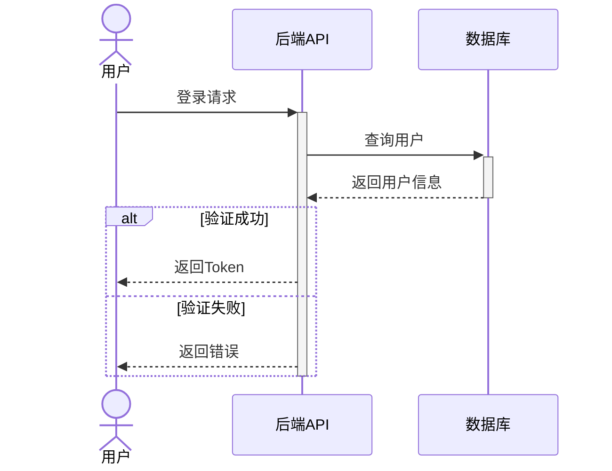
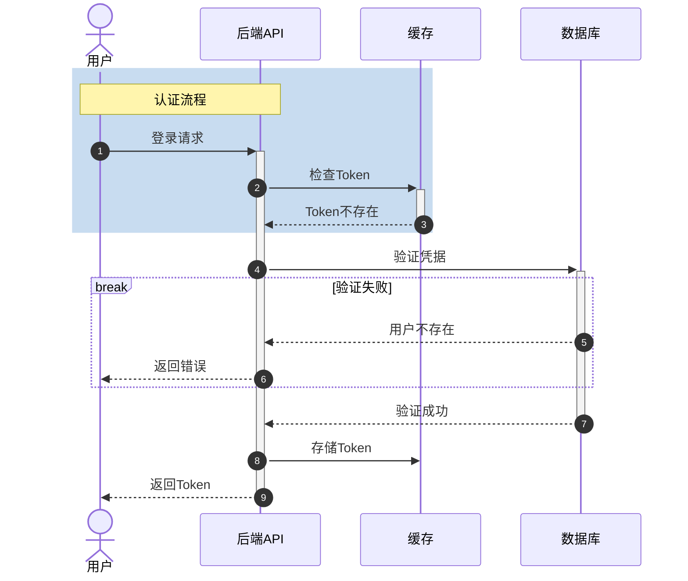
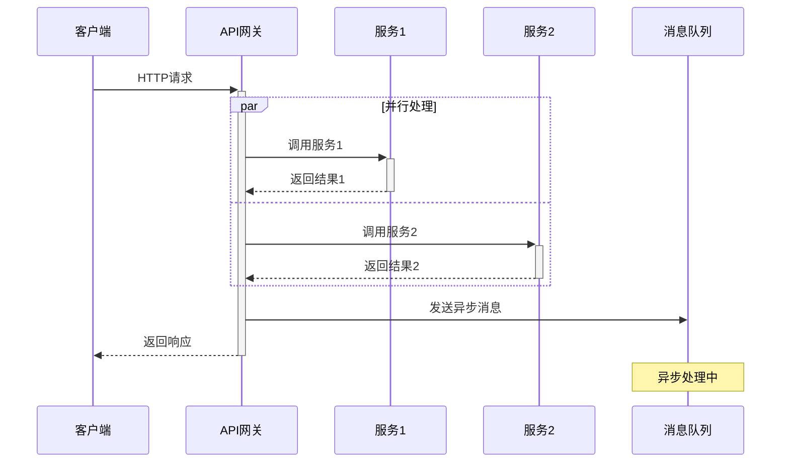

## 核心语法
- 声明: sequenceDiagram

- 参与者类型:
  * participant A as Alice - 矩形框（通用参与者）
  * actor U as User - 人形图标（真人用户）
  * 显式声明控制显示顺序（从左到右）
  * 别名格式: participant 内部ID as 显示名称

- 箭头类型详解:
  * ->> 实线同步调用（带实心箭头）
  * -->> 虚线异步响应/返回（带实心箭头）
  * -> 实线同步调用（带开放箭头）
  * --> 虚线返回（带开放箭头）
  * -x 丢失消息（带 X 标记）
  * -) 异步消息（带开放圆圈）

- 激活框（生命线）:
  * 显式激活: activate 参与者 ... deactivate 参与者
  * 自动激活: ->>+ 激活，-->>- 去激活
  * 必须成对使用，嵌套 ≤3 层
  * 示例:
    A->>+B: 请求
    B-->>-A: 响应

- 块语句:
  * loop 循环条件 ... end - 循环流程
  * alt 条件1 ... else 条件2 ... end - 条件分支
  * opt 可选条件 ... end - 可选流程
  * par 并发1 ... and 并发2 ... end - 并行执行
  * 所有块必须用 end 闭合

- 注释:
  * Note left of Alice: 注释内容
  * Note right of Alice: 注释内容
  * Note over Alice,Bob: 跨越注释

- 致命错误（Kroki）:
  * 最后一行不能是空消息（箭头后只有冒号）
  * ❌ A->>B:
  * ✓ A->>B: 响应 或删除该行

- 参与者名称:
  * 大小写敏感，全文必须一致
  * 包含空格/特殊字符的名称用引号包裹

## 高级语法
- 自动编号:
  * autonumber - 从 1 开始编号所有消息
  * autonumber 10 - 从 10 开始编号
  * autonumber 1 5 - 从 1 开始，步长为 5
  * 位置: 放在参与者声明之后，第一条消息之前

- 矩形框分组:
  * 语法: rect rgb(R, G, B) ... end
  * 或: rect rgba(R, G, B, A) ... end
  * 用途: 将多条消息分组高亮
  * 示例:
    rect rgb(200, 220, 240)
        Note over User,API: 认证流程
        User->>API: 登录
    end

- 高级块语句:
  * break 中断条件 ... end - 中断流程（异常/错误分支）
  * critical 描述 ... option 备选 ... end - 关键区域
  * 示例:
    break 验证失败
        API-->>User: 返回错误
    end

- 消息序号:
  * autonumber 会自动添加序号前缀
  * 格式: 1 消息内容

## Kroki 限制
- ✓ 完全支持 autonumber
- ✓ 支持 rect 矩形框
- ✓ 支持 break/critical 块
- ⚠️ rgba 透明度可能渲染不一致
- ⚠️ 参与者建议 ≤8 个
- ⚠️ 消息数量建议 ≤50 条

常见错误排查：
1. autonumber 位置错误
   ❌ autonumber
      participant A
   ✓ participant A
      autonumber

2. 激活框未配对
   ❌ A->>+B: 请求（缺少去激活）
   ✓ A->>+B: 请求
      B-->>-A: 响应

3. rect 块未闭合
   ❌ rect rgb(200,200,200) ... (缺少 end)
   ✓ rect rgb(200,200,200) ... end

4. break 块语法错误
   ❌ break 条件 (缺少 end)
   ✓ break 条件描述 ... end

5. 参与者名称不一致
   ❌ participant API
      api->>User: 响应
   ✓ participant API
      API->>User: 响应

## 示例

### 示例 1

### 示例 2

### 示例 3

