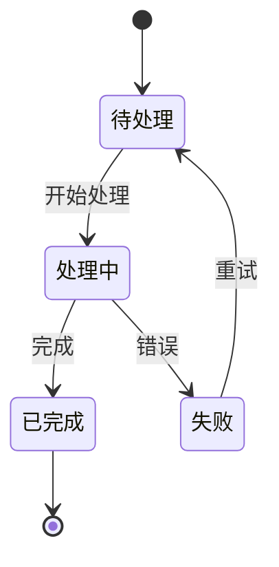
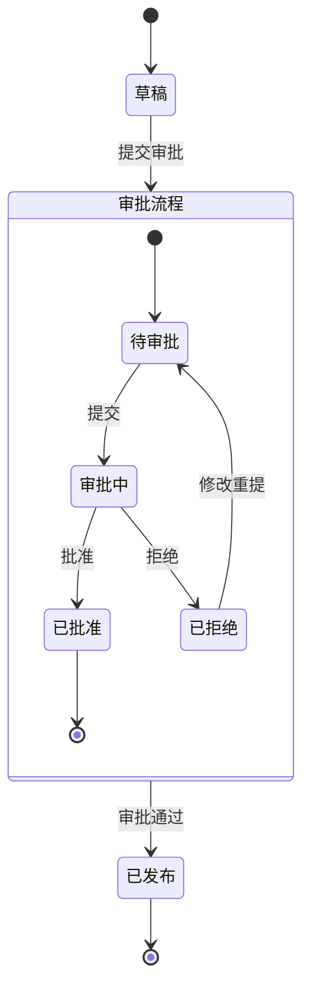
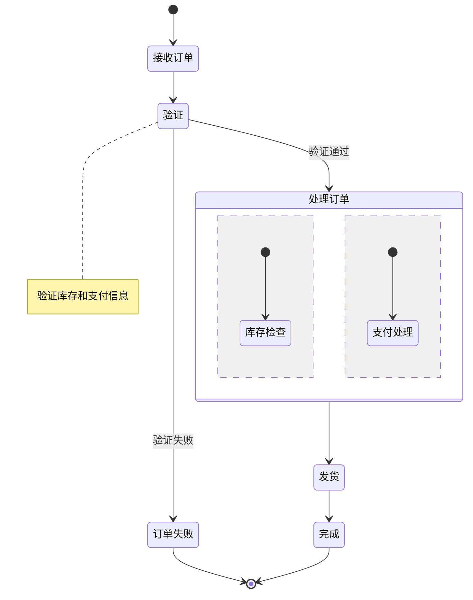

## 核心语法
- 声明: stateDiagram-v2（推荐使用 v2 版本）

- 初始和结束状态:
  * [*] --> 状态名 - 初始状态
  * 状态名 --> [*] - 结束状态
  * [*] 是特殊符号，表示开始/结束

- 状态转换:
  * 基本格式: 状态A --> 状态B
  * 带条件: 状态A --> 状态B: 转换条件
  * 条件应简洁（5-10 字），使用动词

- 状态别名:
  * 语法: state "中文显示名" as alias
  * 用途: 处理特殊字符或空格
  * 示例: state "待处理" as pending

- 嵌套状态:
  * 语法: state 状态名 { ... }
  * 最大深度 ≤3 层
  * 嵌套内可包含子状态和转换
  * 示例:
    state 处理中 {
        [*] --> 验证
        验证 --> 执行
        执行 --> [*]
    }

- 并发状态:
  * 使用 -- 分隔并发区域（两个短横线）
  * 语法:
    state 并发状态 {
        [*] --> 任务A
        --
        [*] --> 任务B
    }

- 选择节点:
  * 语法: state if_state <<choice>>
  * 必须有 ≥2 个分支
  * 示例:
    state check <<choice>>
    待处理 --> check
    check --> 通过: 条件满足
    check --> 拒绝: 条件不满足

- 注释:
  * 语法: note left of 状态: 说明
  * 或: note right of 状态: 说明

- 保留字禁用:
  * 禁止使用: state, direction, note, hide, show
  * 作为状态名时必须使用别名

- 转换条件:
  * 保持简洁: 5-10 字
  * 使用动词: 完成、确认、取消、超时
  * 避免完整句子

## 高级语法
- 状态描述:
  * 语法:
    state 状态名 {
        描述文本
    }
  * 用于添加状态说明

- 复合状态:
  * 包含多个子状态的状态
  * 支持历史状态（记忆上次子状态）
  * 语法: state 状态名 <<history>>

- Fork 和 Join:
  * state fork_state <<fork>>
  * state join_state <<join>>
  * 用于并发流程的分叉和合并

## Kroki 限制
- ✓ 完全支持 v2 语法
- ✓ 支持嵌套状态（≤3 层）
- ✓ 支持并发状态
- ✓ 支持选择节点
- ⚠️ 状态数量建议 ≤30 个
- ⚠️ 避免过深嵌套

常见错误排查：
1. 版本声明错误
   ❌ stateDiagram
   ✓ stateDiagram-v2

2. 并发分隔符错误
   ❌ state 并发 { A --- B }（三个短横）
   ✓ state 并发 { A -- B }（两个短横）

3. 选择节点无分支
   ❌ state check <<choice>>（没有分支）
   ✓ state check <<choice>>
      check --> A: 条件1
      check --> B: 条件2

4. 嵌套状态未闭合
   ❌ state 处理中 { ... （缺少闭合括号）
   ✓ state 处理中 { ... }

5. 使用保留字作状态名
   ❌ state --> note
   ✓ state "state" as st
      st --> note_state

## 示例

### 示例 1

### 示例 2

### 示例 3

