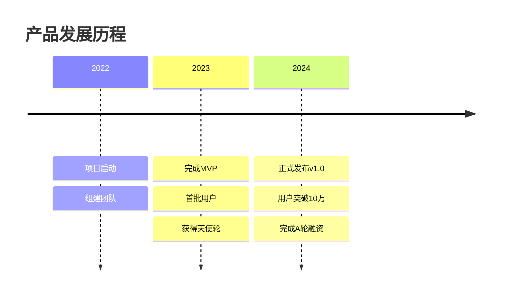
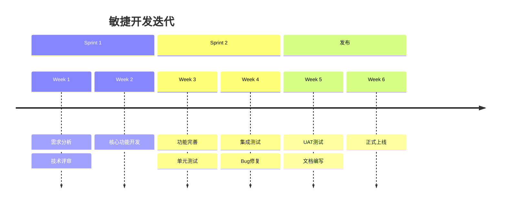
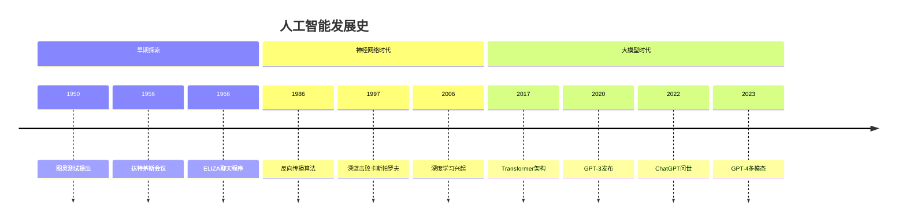

## 核心语法
- 声明: timeline 开头
- 标题（可选）: title 标题文本

- 时间段语法:
  * 时间标签 : 事件描述
  * 示例: 2023 : 产品发布
  * 示例: Q1 2024 : 功能迭代

- 多事件同一时间:
  * 时间标签 : 事件1
              : 事件2
              : 事件3
  * 示例:
    2024 : 发布v1.0
         : 用户突破1万
         : 获得A轮融资

- 分段/章节:
  * section 章节名
  * 后续事件归属该章节
  * 示例:
    section 研发阶段
        2023-01 : 需求分析
        2023-03 : 开发完成
    section 运营阶段
        2023-06 : 正式上线

- 注释语法:
  * %% 注释内容
  * 注释不会在渲染图表中显示

## 高级语法
- 时间格式灵活:
  * 年份: 2023, 2024
  * 季度: Q1 2024, Q2 2024
  * 月份: 2024-01, January 2024
  * 日期: 2024-01-15
  * 自定义: Phase 1, Sprint 1

- 长文本换行:
  * 使用   换行
  * 示例: 2024 : 完成核心功能 开始内测

- 样式配置:
  * %%{init: {'theme': 'forest'}}%%
  * 可用主题: default, forest, dark, neutral

## 设计建议
- 时间点数量: 5-15 个为佳
- 每个时间点: 1-4 个事件
- 使用 section 分组相关事件
- 时间格式保持一致
- 事件描述简洁（10-30 字）

## Kroki 限制
- ✓ 支持基础时间线语法
- ✓ 支持 section 分组
- ✓ 支持多事件同一时间
- ✓ 支持主题配置
- ⚠️ 时间点建议 ≤20 个
- ⚠️ 每时间点事件 ≤5 个

常见错误排查：
1. 注释语法错误
   ❌ // 这是注释
   ❌ # 这是注释
   ✓ %% 这是注释

2. 缺少 timeline 声明
   ❌ 2023 : 事件
   ✓ timeline
      2023 : 事件

3. 多事件缩进错误
   ❌ 2024 : 事件1 : 事件2
   ✓ 2024 : 事件1
          : 事件2

4. section 后缺少事件
   ❌ section 空章节（无内容）
   ✓ section 章节名
      时间 : 事件

## 示例

### 示例 1

### 示例 2

### 示例 3

