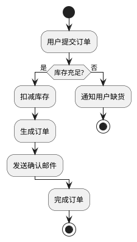
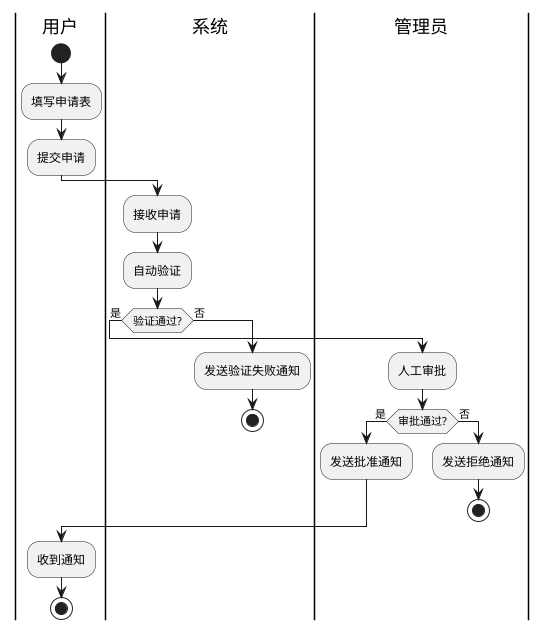

## 核心语法
- 声明包裹:
  * @startuml 和 @enduml 包裹所有内容

- 起止标识:
  * start - 开始节点
  * stop - 正常结束节点
  * end - 终止节点
  * kill - 强制终止（显示X标记）
  * detach - 分离终止（显示圆圈标记）

- 活动节点:
  * 基本语法: :活动名称;
  * 带颜色: #color:活动名称;
  * 示例: :处理订单;
  * 示例: #lightblue:验证用户;
  * 列表格式: - 或 * 开头
  * 嵌套列表: ** 表示子项
  * 示例:
    :以下是步骤
    - 步骤1
    - 步骤2
    ** 子步骤2.1;

- 决策节点（if-then-else）:
  * 语法1:
    if (条件?) then (是)
        :活动A;
    else (否)
        :活动B;
    endif
  * 语法2:
    if (表达式) is (值) then
        :活动;
    endif
  * 语法3:
    if (表达式) equals (值) then
        :活动;
    endif
  * 支持 elseif:
    if (条件1?) then
        :活动A;
    elseif (条件2?) then
        :活动B;
    else
        :活动C;
    endif
  * 垂直布局: !pragma useVerticalIf on

- 多分支决策（switch）:
  * 语法:
    switch (变量)
    case (值1)
        :活动1;
    case (值2)
        :活动2;
    endswitch

- 并行活动（fork-join）:
  * 语法:
    fork
        :活动1;
    fork again
        :活动2;
    fork again
        :活动3;
    end fork
  * 或使用: end merge（合并）
  * 连接标签: end fork {or} 或 {and}
  * 所有分支并发执行，完成后汇聚

- 分割活动（split）:
  * 语法:
    split
        :活动1;
    split again
        :活动2;
    end split
  * 同时开始，独立结束

- 循环（while）:
  * 语法:
    while (条件?) is (是)
        :循环体;
    endwhile (否)
  * backward 语法:
    while (条件?)
        :活动;
        backward:返回操作;
    endwhile

- 重复循环（repeat）:
  * 语法:
    repeat
        :循环体;
    backward:返回;
    repeat while (条件?)
  * break 语法: 使用 break 退出循环

- 泳道分组:
  * 语法: |泳道名称|
  * 代表角色/部门/系统
  * 示例:
    |用户|
    :提交申请;
    |管理员|
    :审批申请;

- 注释语法:
  * 单行注释: ' 注释内容
  * 多行注释: /' 注释内容 '/
  * ❌ 不支持 // 或 #（这是其他引擎的语法）

- 图表注释:
  * note left: 左侧注释
  * note right: 右侧注释
  * floating note: 浮动注释

- 分隔符:
  * ==阶段标题== - 逻辑分段
  * 用于分隔不同阶段

## 高级语法
- 分组容器:
  * group 名称 { } end group
  * partition 名称 { }
  * package 名称 { }
  * rectangle 名称 { }
  * card 名称 { }
  * 带颜色: partition #lightGreen "名称" { }
  * 带链接: partition "[[url text]]" { }

- 标签和跳转:
  * label <标签名> - 定义标签
  * goto <标签名> - 跳转到标签

- 箭头样式:
  * -> 标准箭头
  * -[#color]-> 带颜色
  * -[#blue,dashed]-> 虚线箭头
  * -[bold]-> 粗箭头
  * -[hidden]-> 隐藏箭头（用于布局）
  * 箭头文本: -> 文本说明;

- 连接器（圆圈）:
  * (A) - 定义连接点
  * #blue:(B) - 带颜色的连接点

- SDL 构造型:
  * <<input>> - 输入
  * <<output>> - 输出
  * <<procedure>> - 过程
  * <<load>> - 加载
  * <<save>> - 保存
  * <<continuous>> - 连续
  * <<task>> - 任务

## 设计建议
- 活动数量: 10-30 个
- 决策节点: 3-8 个
- 并行活动: ≤4 个分支
- 泳道数量: 3-6 个
- 避免悬空分支
- 循环必须有退出条件

## Kroki 限制
- ✓ 完全支持所有控制结构
- ✓ 支持泳道
- ✓ 支持并行和循环
- ⚠️ 活动节点建议 ≤50 个
- ⚠️ 泳道建议 ≤8 个

常见错误排查：
1. 注释语法错误
   ❌ // 这是注释（错误，PlantUML 不支持 //）
   ❌ # 这是注释（错误，PlantUML 不支持 #）
   ✓ ' 这是单行注释
   ✓ /' 这是多行注释 '/

2. 决策未闭合
   ❌ if (条件?) then
          :活动;
      （缺少 endif）
   ✓ if (条件?) then
          :活动;
      endif

3. 并行活动未闭合
   ❌ fork
          :活动1;
      fork again
          :活动2;
      （缺少 end fork）
   ✓ fork
          :活动1;
      fork again
          :活动2;
      end fork

4. 循环未闭合
   ❌ while (条件?)
          :活动;
      （缺少 endwhile）
   ✓ while (条件?) is (是)
          :活动;
      endwhile (否)

5. 泳道语法错误
   ❌ |用户
   ✓ |用户|

6. 活动缺少分号
   ❌ :处理订单
   ✓ :处理订单;


## 示例

### 示例 1



### 示例 2



### 示例 3

```plantuml
@startuml
start

==初始化阶段==
:加载配置;
:连接数据库;

==处理阶段==
fork
  :处理任务A;
fork again
  :处理任务B;
fork again
  :处理任务C;
end fork

==验证阶段==
while (有未处理项?) is (是)
  :处理下一项;
  if (处理成功?) then (是)
    :记录成功;
  else (否)
    :记录失败;
  endif
endwhile (否)

==清理阶段==
:关闭连接;
:生成报告;

stop
@enduml
```
