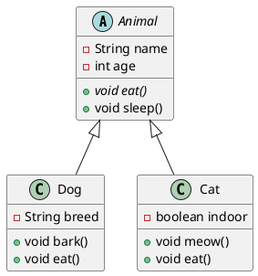
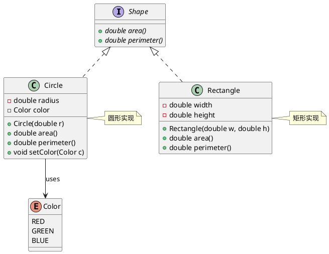
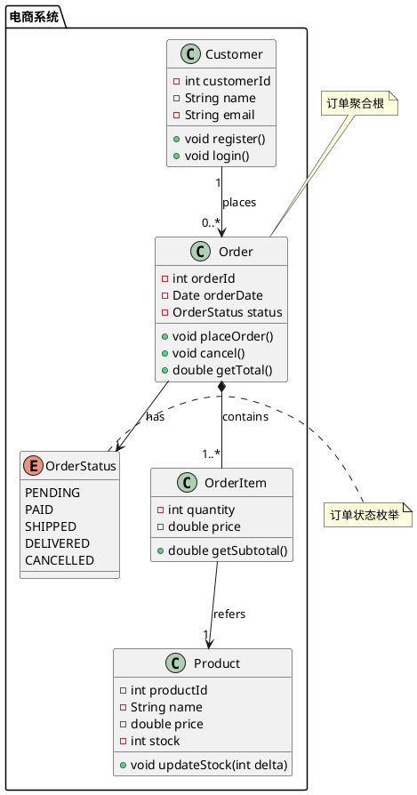

## 核心语法
- 声明包裹:
  * @startuml 和 @enduml 包裹所有内容

- 类定义方式:
  * 方式1（推荐）:
    class 类名 {
        属性
        方法
    }
  * 方式2（简化）:
    class 类名
  * 其他类型:
    - abstract class 抽象类名
    - interface 接口名
    - enum 枚举名
    - annotation 注解名
    - exception 异常名
    - protocol 协议名
    - struct 结构体名
    - dataclass 数据类名
    - record 记录类名

- 可见性修饰符（必须标注）:
  * - private（私有）
  * + public（公开）
  * # protected（受保护）
  * ~ package（包级别）

- 属性语法:
  * 格式: 可见性 类型 名称
  * 示例: - String name
  * 示例: + int age
  * 静态属性: {static} 或下划线
  * 示例: - {static} int count

- 方法语法:
  * 格式: 可见性 返回类型 方法名(参数类型 参数名)
  * 示例: + void setName(String name)
  * 示例: + String getName()
  * 静态方法: {static}
  * 示例: + {static} getInstance() Singleton
  * 抽象方法: {abstract}
  * 示例: + {abstract} void eat()

- 关系类型:
  * <|-- 或 --|> 继承（实线三角箭头）
  * <|.. 或 ..|> 实现（虚线三角箭头）
  * *-- 或 --* 组合（实心菱形，生命周期绑定）
  * o-- 或 --o 聚合（空心菱形，生命周期独立）
  * --> 或 <-- 关联（实线箭头）
  * ..> 或 <.. 依赖（虚线箭头）
  * -- 无方向关联
  * 可用 .. 替代 -- 变为虚线

- 关系方向规则:
  * 继承/实现: 子类→父类，实现类→接口
  * 组合/聚合: 整体→部分
  * 关联/依赖: 根据语义决定

- 关键字语法:
  * extends - 继承关系
  * implements - 实现关系
  * 示例: Class01 extends Class02
  * 示例: Class03 implements Interface01

- 类修饰符:
  * abstract class 抽象类名 - 抽象类
  * interface 接口名 - 接口
  * class 类名 <<stereotype>> - 构造型
  * 常用构造型: <<interface>>, <<abstract>>, <<enumeration>>, <<entity>>, <<service>>

- 基数/多重性:
  * 语法: "1", "0..1", "1..*", "*", "0..*"
  * 示例: Class1 "1" --> "0..*" Class2

- 命名规范:
  * 类名: PascalCase（如 UserService）
  * 方法/属性: camelCase（如 getUserName）
  * 常量: UPPER_SNAKE_CASE（如 MAX_SIZE）

## 高级语法
- 泛型:
  * 语法: class List<T>
  * 示例: class Map<K,V>

- 枚举类:
  * 语法:
    enum 枚举名 {
        值1
        值2
    }
  * 或使用 <<enumeration>> 构造型

- 内部类:
  * 语法:
    class Outer {
        class Inner
    }

- 抽象类和方法:
  * 抽象类: abstract class 类名
  * 抽象方法: {abstract} 或斜体标记

- 包/命名空间:
  * 语法:
    package 包名 {
        class 类名
    }

- 注释语法:
  * 单行注释: ' 注释内容
  * 多行注释: /' 注释内容 '/
  * ❌ 不支持 // 或 #（这是其他引擎的语法）

- 图表注释:
  * note left of 类名: 注释
  * note right of 类名: 注释
  * note top of 类名: 注释
  * note bottom of 类名: 注释
  * note "注释" as N1
  * 类名 .. N1

- 类体分隔符:
  * -- 实线分隔符
  * .. 虚线分隔符
  * == 双线分隔符
  * __ 粗线分隔符
  * 可在分隔符间添加节标题

- 样式定制:
  * 类名 #颜色 - 设置边框颜色
  * 类名 ##颜色 - 设置背景色
  * 类名 #back:red;line:00FFFF;line.bold - 详细样式
  * 示例: class User #red
  * 示例: class Bar #palegreen ##[dashed]green

- 关系样式:
  * 链接颜色和样式: -[#color]->
  * 示例: foo -[bold]-> bar
  * 示例: foo -[#red,dashed,thickness=2]-> bar

- 关系标签:
  * 语法: Class1 --> Class2 : 标签
  * 示例: Dog --|> Animal : extends

- 隐藏和移除:
  * hide 类名 members - 隐藏成员
  * hide empty members - 隐藏空成员
  * hide @unlinked - 隐藏未连接的类
  * remove 类名 - 移除类
  * show 类名 methods - 只显示方法

- 关联类:
  * 语法: (Class1, Class2) .. AssociationClass
  * 示例: (Student, Course) .. Enrollment

## 设计建议
- 类数量: 5-20 个为佳
- 关系数量: 8-30 条
- 继承层级: ≤5 层
- 每个类: 3-10 个属性/方法
- 避免循环依赖

## Kroki 限制
- ✓ 完全支持所有关系类型
- ✓ 支持泛型
- ✓ 支持枚举和抽象类
- ✓ 支持包/命名空间
- ⚠️ 类建议 ≤30 个
- ⚠️ 关系建议 ≤50 条

常见错误排查：
1. 注释语法错误
   ❌ // 这是注释（错误，PlantUML 不支持 //）
   ❌ # 这是注释（错误，PlantUML 不支持 #）
   ✓ ' 这是单行注释
   ✓ /' 这是多行注释 '/

2. 缺少可见性修饰符
   ❌ String name
   ✓ + String name

3. 关系方向错误
   ❌ Animal <|-- Dog（父类→子类错误）
   ✓ Dog --|> Animal（子类→父类正确）

4. 抽象方法语法错误
   ❌ abstract void eat()
   ✓ + {abstract} void eat()

5. 泛型语法错误（PlantUML支持<>）
   ✓ class List<T>
   ✓ class Map<K,V>

6. 方法参数格式错误
   ❌ + setName(name)
   ✓ + setName(String name)

## 示例

### 示例 1

### 示例 2

### 示例 3

