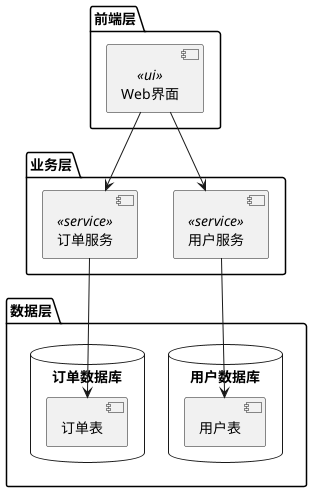
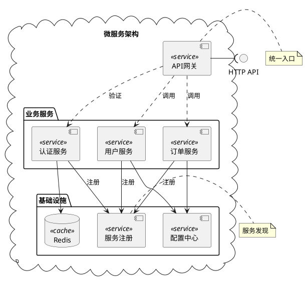
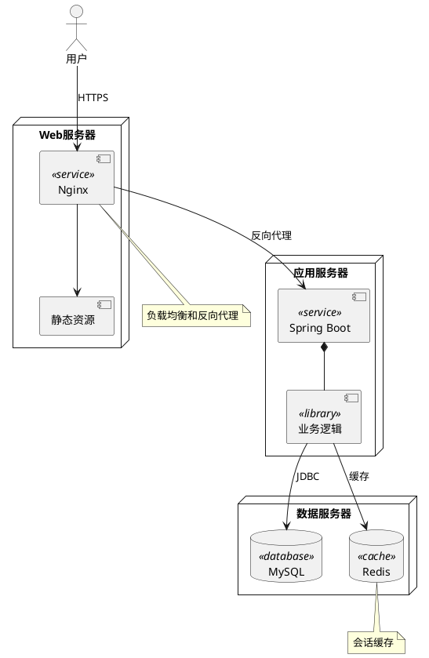

## 核心语法
- 声明包裹:
  * @startuml 和 @enduml 包裹所有内容

- 组件声明:
  * 方式1: [组件名称]
  * 方式2: component "组件名称" as 别名
  * 示例: [Web界面]
  * 示例: component "用户服务" as UserService

- 构造型（Stereotype）:
  * 语法: [组件名] <<stereotype>>
  * 常用构造型:
    - <<service>> - 服务
    - <<library>> - 库
    - <<database>> - 数据库
    - <<api>> - API
    - <<ui>> - 用户界面
    - <<queue>> - 队列
    - <<cache>> - 缓存
  * 示例: [用户服务] <<service>>

- 接口声明:
  * 提供接口（lollipop）: () "接口名称"
  * 需要接口（socket）: interface 接口名称
  * 示例: () "HTTP API"
  * 示例: interface "数据库接口"

- 依赖关系:
  * ..> 使用依赖（虚线箭头）
  * --> 关联（实线箭头）
  * *-- 组合（实心菱形）
  * o-- 聚合（空心菱形）
  * -- 无方向连接

- 接口连接:
  * 提供接口: 组件 -( 接口
  * 需要接口: 组件 )- 接口
  * 直接连接: 组件1 -- 组件2

- 分组容器:
  * package "包名称" { ... }
  * node "节点名称" { ... }
  * database "数据库名称" { ... }
  * cloud "云服务名称" { ... }
  * folder "文件夹名称" { ... }
  * frame "框架名称" { ... }

- 端口:
  * 语法: port "端口名称" as 别名
  * 或: portin/portout 区分输入输出

- 层次架构规则:
  * UI 层 → 业务层 → 数据层
  * 单向依赖，避免跨层
  * 避免循环依赖

## 高级语法
- 接口详细定义:
  * interface "接口名" as I1 {
        方法1()
        方法2()
    }

- 组件详细定义:
  * component "组件名" as C1 {
        数据
        行为
    }

- 链接样式:
  * 组件1 -[#red]-> 组件2 - 红色箭头
  * 组件1 -[#blue,dashed]-> 组件2 - 蓝色虚线

- 链接标签:
  * 组件1 --> 组件2 : 标签
  * 示例: [前端] --> [后端] : HTTP

- 注释:
  * note left of 组件: 注释
  * note right of 组件: 注释
  * note top of 组件: 注释
  * note bottom of 组件: 注释

- 隐藏元素:
  * hide 组件名
  * remove 组件名

## 设计建议
- 组件数量: 5-15 个为佳
- 接口数量: 3-10 个
- 分组层级: ≤3 层
- 依赖关系: 清晰单向
- 命名规范: 使用有意义的名称
- 粒度适中: 不要过细或过粗

### 典型架构模式
- 三层架构: UI → Business → Data
- 微服务: Service1 ↔ Service2 ↔ Service3
- 插件架构: Core → Plugin1/Plugin2/Plugin3
- 事件驱动: Component → EventBus → Component

## Kroki 限制
- ✓ 完全支持所有组件类型
- ✓ 支持接口定义
- ✓ 支持分组容器
- ⚠️ 组件建议 ≤30 个
- ⚠️ 连接建议 ≤50 条

常见错误排查：
1. 组件名称未使用方括号
   ❌ 组件A --> 组件B
   ✓ [组件A] --> [组件B]

2. 构造型语法错误
   ❌ [组件] <service>
   ✓ [组件] <<service>>

3. 接口连接方向错误
   ❌ 组件 (- 接口（需要接口用错符号）
   ✓ 组件 )- 接口（需要接口）
   ✓ 组件 -( 接口（提供接口）

4. 分组未闭合
   ❌ package "包名" {
          [组件]
      （缺少闭合括号）
   ✓ package "包名" {
          [组件]
      }

5. 循环依赖
   ❌ [A] --> [B]
      [B] --> [A]
   ✓ 重新设计，消除循环

## 示例

### 示例 1

### 示例 2

### 示例 3

