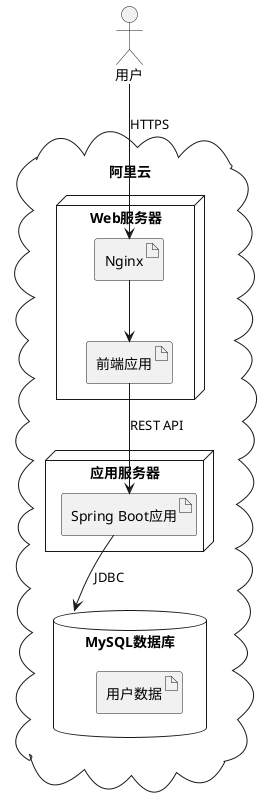
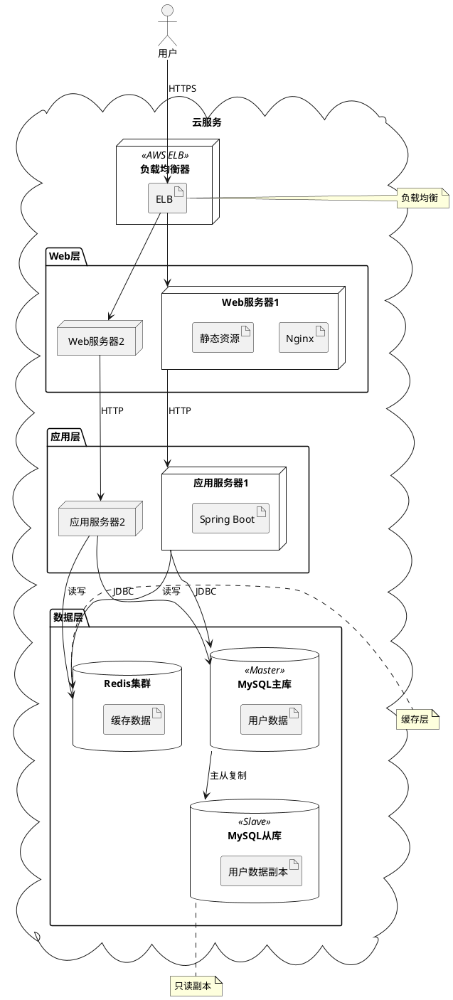
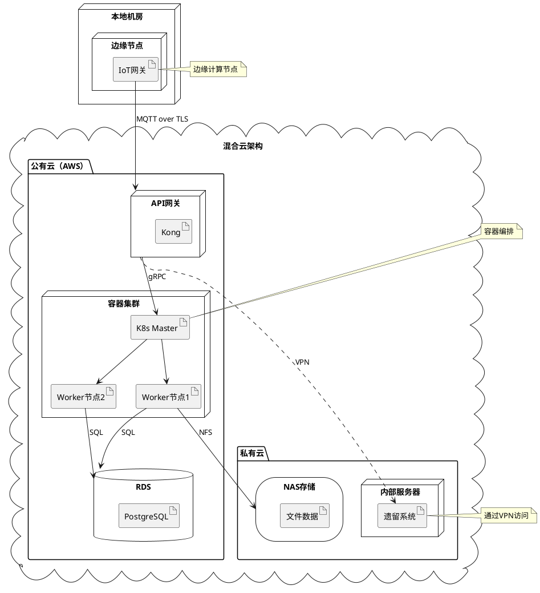

## 核心语法
- 声明包裹:
  * @startuml 和 @enduml 包裹所有内容

- 节点类型:
  * actor - 参与者
  * agent - 代理
  * artifact - 软件工件/应用
  * boundary - 边界
  * card - 卡片
  * circle - 圆形
  * cloud - 云服务
  * collections - 集合
  * component - 组件
  * control - 控制器
  * database - 数据库
  * entity - 实体
  * file - 文件
  * folder - 文件夹
  * frame - 框架容器
  * hexagon - 六边形
  * interface - 接口
  * label - 标签
  * node - 通用节点/服务器
  * package - 软件包
  * person - 人物
  * process - 进程
  * queue - 队列
  * rectangle - 矩形
  * stack - 堆栈
  * storage - 存储设备
  * usecase - 用例

- 部署关系:
  * 嵌套方式（推荐）:
    node "服务器" {
        artifact "应用"
    }
  * 连接方式:
    node "服务器"
    artifact "应用"
    "服务器" -> "应用"

- 通信协议:
  * --> 有向通信
  * -- 双向通信
  * 标签标注协议
  * 示例: [前端] --> [后端] : HTTP
  * 示例: [应用] --> [数据库] : JDBC

- 嵌套层次:
  * 层次结构: package/cloud → node → artifact
  * 最大层级 ≤3 层
  * 示例:
    cloud "阿里云" {
        node "Web服务器" {
            artifact "Nginx"
        }
    }

- 短形式语法:
  * actor: :actor_name:
  * component: [component_name]
  * interface: () "interface_name"
  * usecase: (usecase_name)

- 连接样式:
  * 基础线型:
    - -- 实线
    - == 粗线
    - .. 虚线
    - ~~ 波浪线
  * 箭头头部类型:
    - --> 标准箭头
    - --* 星号
    - --o 空心圆
    - --+ 加号
    - --# 方块
    - -->> 双箭头
    - --0 数字0
    - --^ 插入符
    - --(0 带括号的0
  * 圆形连接:
    - 0--0, )--(, 0)--(0, 0)--, -0)-, -(0)-, -(0-, --(0, --(

- 网络标记:
  * 语法: [节点1] --> [节点2] : 协议
  * 示例: [客户端] --> [服务器] : HTTPS

## 高级语法
- 构造型:
  * node "名称" <<stereotype>>
  * 示例: node "Web服务器" <<Apache>>
  * 示例: database "MySQL" <<5.7>>

- 链接颜色:
  * [节点1] -[#red]-> [节点2]
  * [节点1] -[#0000FF]-> [节点2]

- 链接样式（括号内联）:
  * [节点1] -[bold]-> [节点2]
  * [节点1] -[dashed]-> [节点2]
  * [节点1] -[#red,dashed,thickness=2]-> [节点2]

- 方向控制:
  * 全局: top to bottom direction（默认）
  * 全局: left to right direction
  * 箭头方向: left/right/up/down
  * 示例: [A] -left-> [B]

- 注释语法:
  * 单行注释: ' 注释内容
  * 多行注释: /' 注释内容 '/
  * ❌ 不支持 // 或 #（这是其他引擎的语法）

- 图表注释:
  * note left of 节点: 注释
  * note right of 节点: 注释
  * note "注释" as N1
  * 节点 .. N1

- 混合图元:
  * allowmixing - 允许混合类图、部署图元素
  * json JSON { "key": "value" } - 嵌入JSON数据显示

- 内联样式:
  * node n #颜色;line:蓝色;line.dotted;text:红色
  * 示例: node n #aliceblue;line:blue;line.dotted;text:red

- 全局样式:
  *  块
  * 示例:
    

## 设计建议
- 节点数量: 5-20 个
- 工件数量: 10-40 个
- 嵌套层级: ≤3 层
- 连接数量: 10-30 条
- 清晰标注协议和端口

### 典型部署场景
- 单机部署: 所有组件在一个节点
- 三层部署: Web层、应用层、数据层
- 云原生: 容器、微服务、负载均衡
- 混合云: 本地+云服务
- 高可用: 主从、集群、负载均衡

性能约束（Kroki）:
- 节点 ≤40 个
- 工件 ≤60 个
- 嵌套 ≤3 层
- 连接 ≤80 条
- 复杂系统应按地域/层级/功能拆分

## Kroki 限制
- ✓ 支持所有节点类型
- ✓ 支持嵌套结构
- ✓ 支持通信协议标注
- ⚠️ 节点建议 ≤30 个
- ⚠️ 工件建议 ≤50 个
- ⚠️ 避免过度嵌套

常见错误排查：
1. 注释语法错误
   ❌ // 这是注释（错误，PlantUML 不支持 //）
   ❌ # 这是注释（错误，PlantUML 不支持 #）
   ✓ ' 这是单行注释
   ✓ /' 这是多行注释 '/

2. 嵌套未闭合
   ❌ node "服务器" {
          artifact "应用"
      （缺少闭合括号）
   ✓ node "服务器" {
          artifact "应用"
      }

3. 节点名称未引号
   ❌ node Web服务器
   ✓ node "Web服务器"

4. 工件和节点混淆
   ❌ node "Nginx"（Nginx 是软件，应该是 artifact）
   ✓ artifact "Nginx"

5. 协议标注位置错误
   ❌ HTTP : [A] --> [B]
   ✓ [A] --> [B] : HTTP

6. 过度嵌套
   ❌ 5-6 层嵌套
   ✓ ≤3 层嵌套

## 示例

### 示例 1

### 示例 2

### 示例 3

