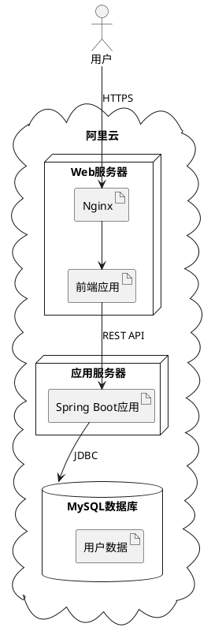
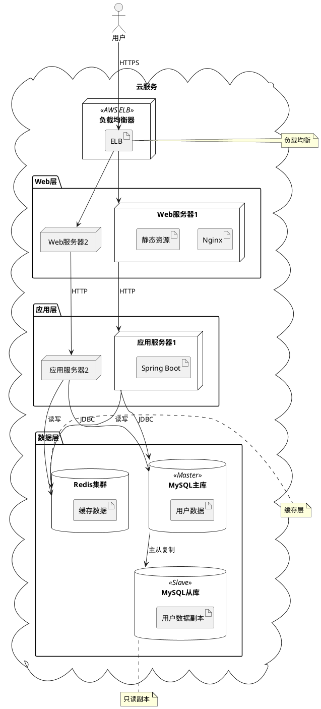
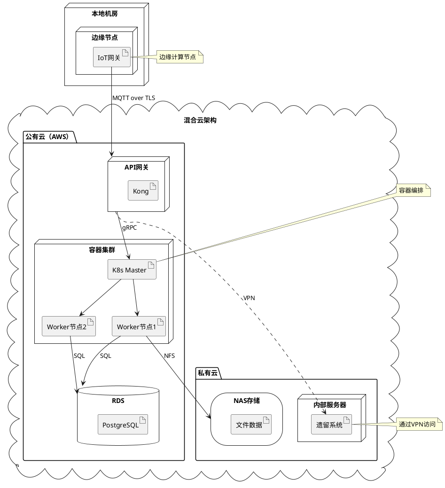

## 核心语法
- 声明包裹:
  * @startuml 和 @enduml 包裹所有内容

- 节点类型:
  * node "节点名称" - 通用节点/服务器
  * artifact "工件名称" - 软件工件/应用
  * database "数据库名称" - 数据库
  * cloud "云服务名称" - 云服务
  * folder "文件夹名称" - 文件夹
  * package "软件包名称" - 软件包
  * frame "框架名称" - 框架容器
  * storage "存储名称" - 存储设备

- 部署关系:
  * 嵌套方式（推荐）:
    node "服务器" {
        artifact "应用"
    }
  * 连接方式:
    node "服务器"
    artifact "应用"
    "服务器" -> "应用"

- 通信协议:
  * --> 有向通信
  * -- 双向通信
  * 标签标注协议
  * 示例: [前端] --> [后端] : HTTP
  * 示例: [应用] --> [数据库] : JDBC

- 嵌套层次:
  * 层次结构: package/cloud → node → artifact
  * 最大层级 ≤3 层
  * 示例:
    cloud "阿里云" {
        node "Web服务器" {
            artifact "Nginx"
        }
    }

- 连接样式:
  * 实线: -- 或 -->
  * 虚线: .. 或 ..>
  * 粗线: == 或 ==>

- 网络标记:
  * 语法: [节点1] --> [节点2] : 协议
  * 示例: [客户端] --> [服务器] : HTTPS

## 高级语法
- 构造型:
  * node "名称" <<stereotype>>
  * 示例: node "Web服务器" <<Apache>>
  * 示例: database "MySQL" <<5.7>>

- 链接颜色:
  * [节点1] -[#red]-> [节点2]
  * [节点1] -[#0000FF]-> [节点2]

- 链接样式:
  * [节点1] -[bold]-> [节点2]
  * [节点1] -[dashed]-> [节点2]

- 标签位置:
  * left/right/up/down
  * 示例: [A] -left-> [B]

- 注释:
  * note left of 节点: 注释
  * note right of 节点: 注释
  * note "注释" as N1
  * 节点 .. N1

- 参与者:
  * actor 用户
  * 用于表示系统外部用户

## 设计建议
- 节点数量: 5-20 个
- 工件数量: 10-40 个
- 嵌套层级: ≤3 层
- 连接数量: 10-30 条
- 清晰标注协议和端口

### 典型部署场景
- 单机部署: 所有组件在一个节点
- 三层部署: Web层、应用层、数据层
- 云原生: 容器、微服务、负载均衡
- 混合云: 本地+云服务
- 高可用: 主从、集群、负载均衡

性能约束（Kroki）:
- 节点 ≤40 个
- 工件 ≤60 个
- 嵌套 ≤3 层
- 连接 ≤80 条
- 复杂系统应按地域/层级/功能拆分

## Kroki 限制
- ✓ 支持所有节点类型
- ✓ 支持嵌套结构
- ✓ 支持通信协议标注
- ⚠️ 节点建议 ≤30 个
- ⚠️ 工件建议 ≤50 个
- ⚠️ 避免过度嵌套

常见错误排查：
1. 嵌套未闭合
   ❌ node "服务器" {
          artifact "应用"
      （缺少闭合括号）
   ✓ node "服务器" {
          artifact "应用"
      }

2. 节点名称未引号
   ❌ node Web服务器
   ✓ node "Web服务器"

3. 工件和节点混淆
   ❌ node "Nginx"（Nginx 是软件，应该是 artifact）
   ✓ artifact "Nginx"

4. 协议标注位置错误
   ❌ HTTP : [A] --> [B]
   ✓ [A] --> [B] : HTTP

5. 过度嵌套
   ❌ 5-6 层嵌套
   ✓ ≤3 层嵌套

## 示例

### 示例 1

### 示例 2

### 示例 3

