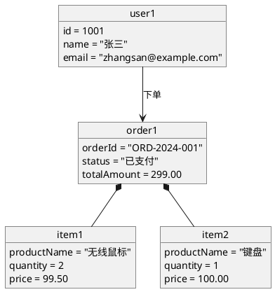
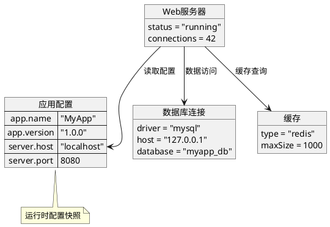

## 核心语法
- 声明包裹:
  * @startuml 和 @enduml 包裹所有内容

- 对象声明:
  * object 对象名 - 声明对象
  * object "显示名" as 别名
  * 示例: object user1
  * 示例: object "用户实例" as u1

- 对象属性:
  * object 对象名 {
        属性名 = 值
        属性名 = "字符串值"
    }
  * 示例:
    object user1 {
        name = "张三"
        age = 25
    }

- 对象关系:
  * --> 关联
  * --* 组合
  * --o 聚合
  * <|-- 继承
  * -- 无方向关联
  * 示例: order1 --> user1
  * 示例: order1 --* item1

- 关系标签:
  * 语法: 对象1 --> 对象2 : 标签
  * 示例: order1 --> user1 : 下单用户

- 类型标注:
  * object 对象名 : 类名
  * 示例: object user1 : User

- 注释语法:
  * 单行注释: ' 注释内容
  * 多行注释: /' 注释内容 '/

## 高级语法
- 对象分组:
  * package 包名 {
        object obj1
        object obj2
    }
  * rectangle 矩形名 {
        object obj1
    }

- map 对象（键值对）:
  * map 对象名 {
        key1 => value1
        key2 => value2
    }
  * 示例:
    map config {
        host => localhost
        port => 8080
    }

- 对象链接到 map:
  * 对象 --> map::key
  * 示例: server --> config::host

- 图表注释:
  * note left of 对象 : 注释
  * note right of 对象 : 注释
  * note top of 对象 : 注释
  * note bottom of 对象 : 注释

- 方向控制:
  * left to right direction
  * top to bottom direction

- 对象颜色:
  * object 对象名 #颜色
  * 示例: object error #red
  * 示例: object success #palegreen

- 关系样式:
  * 对象1 -[#color]-> 对象2
  * 对象1 -[bold]-> 对象2
  * 对象1 -[dashed]-> 对象2

- 隐藏链接:
  * 对象1 -[hidden]-> 对象2
  * 用于调整布局

## 设计建议
- 对象数量: 3-12 个为佳
- 关系数量: 5-20 条
- 属性数量: 每对象 2-6 个
- 展示关键实例，不求完整
- 使用实际数据值

## Kroki 限制
- ✓ 完全支持对象声明
- ✓ 支持属性定义
- ✓ 支持 map 对象
- ✓ 支持所有关系类型
- ⚠️ 对象建议 ≤20 个
- ⚠️ 避免过多属性（每对象 ≤10）

常见错误排查：
1. 注释语法错误
   ❌ // 这是注释
   ✓ ' 这是单行注释

2. 属性格式错误
   ❌ object user { name: "张三" }
   ✓ object user { name = "张三" }

3. 字符串值未加引号
   ❌ name = 张三
   ✓ name = "张三"

4. 对象名冲突
   ❌ object class（class 是保留字）
   ✓ object myClass

5. map 语法错误
   ❌ map config { key: value }
   ✓ map config { key => value }


## 示例

### 示例 1



### 示例 2

```plantuml
@startuml
object "单例实例" as singleton : Singleton {
    instance = this
    data = "共享数据"
}

object "客户端A" as clientA : Client {
    name = "ClientA"
}

object "客户端B" as clientB : Client {
    name = "ClientB"
}

clientA --> singleton : getInstance()
clientB --> singleton : getInstance()

note right of singleton : 单例模式\n全局唯一实例
@enduml
```

### 示例 3


