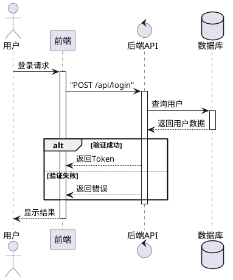
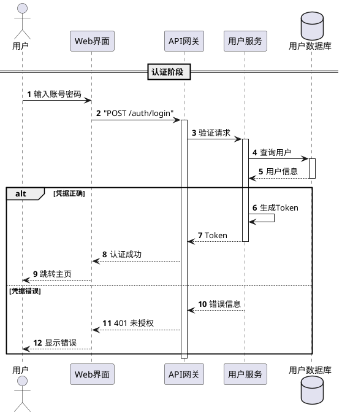
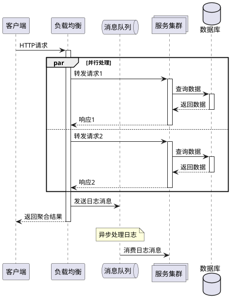

## 核心语法
- 声明包裹:
  * 强制规则: @startuml 和 @enduml 包裹所有内容
  * 缺少会导致渲染失败

- 参与者类型:
  * participant - 矩形框（通用参与者）
  * actor - 人形图标（真人用户）
  * boundary - 边界（系统边界）
  * control - 控制器（业务逻辑）
  * entity - 实体（数据对象）
  * database - 数据库（存储系统）
  * queue - 队列（消息队列）
  * collections - 集合

- 参与者声明:
  * 语法: participant "显示名" as 别名
  * 示例: participant "前端" as Frontend
  * 声明顺序决定从左到右的显示顺序
  * 别名用于后续引用

- 箭头类型详解:
  * -> 实线同步调用（开放箭头）
  * --> 实线同步返回（开放箭头）
  * ->> 实线异步消息（实心箭头）
  * -->> 实线异步响应（实心箭头）
  * ->x 丢失消息（X 标记）
  * ->o 终止消息（圆圈标记）
  * <-> 双向消息
  * <--> 双向同步消息

- 箭头样式:
  * 实线: - 或 -
  * 虚线: -- 或 --
  * 粗线: -[] 或 --[]

- 激活状态管理:
  * 显式方式: activate 参与者 ... deactivate 参与者
  * 自动方式: ++ 激活，-- 去激活（推荐）
  * 示例: A -> B++ : 请求（激活 B）
  * 示例: B --> A-- : 响应（去激活 B）
  * 必须正确配对，否则生命线错误

- 分组结构:
  * alt/else/end - 条件分支（二选一或多选一）
  * opt/end - 可选流程（执行或不执行）
  * loop/end - 循环流程
  * par/end - 并行流程
  * break/end - 中断流程
  * critical/end - 关键区域
  * group 标题/end - 逻辑分组
  * 最大嵌套层级 ≤3 层

- 特殊字符处理:
  * 包含 []{}() 的文本必须用双引号包裹
  * 示例: "POST /api/login"
  * 示例: "get[index]"

- 消息文本:
  * 语法: A -> B: 消息内容
  * 支持多行: A -> B: 第一行\n第二行

## 高级语法
- 自动编号:
  * autonumber - 从 1 开始自动编号
  * autonumber 10 - 从 10 开始
  * autonumber 10 5 - 从 10 开始，步长 5
  * autonumber stop - 停止编号
  * autonumber resume - 恢复编号

- 延迟标记:
  * 语法: ...
  * 或: ...5 分钟后...
  * 表示时间流逝或异步等待

- 消息序号:
  * 语法: A -> B: <b>1.</b> 消息
  * 手动添加序号和样式

- 返回消息:
  * 语法: return 返回内容
  * 自动返回到最近的调用者

- 引用/片段:
  * ref over A,B: 引用内容
  * 用于标注外部交互或文档引用

- 注释:
  * note left: 左侧注释
  * note right: 右侧注释
  * note over A: 在 A 上方注释
  * note over A,B: 跨 A 和 B 注释
  * hnote - 六边形注释
  * rnote - 矩形注释

- 分隔符:
  * == 标题 == - 逻辑分段
  * 用于分隔不同阶段

- 生命线操作:
  * destroy 参与者 - 销毁参与者
  * create 参与者 - 创建参与者

- 消息延迟:
  * A -[#red]> B - 红色箭头
  * A -[#0000FF]> B - 蓝色箭头（十六进制）

## 设计建议
- 参与者数量: 3-8 个为佳
- 消息数量: 15-40 条
- 嵌套层级: ≤3 层
- 激活框: 避免过长的激活
- 逻辑分组: 使用 group 和 == 分段

## Kroki 限制
- ✓ 完全支持所有参与者类型
- ✓ 支持所有箭头类型
- ✓ 支持嵌套分组（≤3 层）
- ✓ 支持自动编号
- ⚠️ 参与者建议 ≤10 个
- ⚠️ 消息建议 ≤60 条

常见错误排查：
1. 缺少包裹标记
   ❌ actor 用户
      用户 -> 系统
   ✓ @startuml
      actor 用户
      用户 -> 系统
      @enduml

2. 激活框未配对
   ❌ A -> B++
      （缺少去激活）
   ✓ A -> B++
      B --> A--

3. 分组未闭合
   ❌ alt 成功
          A -> B
      （缺少 end）
   ✓ alt 成功
          A -> B
      end

4. 特殊字符未引号
   ❌ A -> B: POST /api/login
   ✓ A -> B: "POST /api/login"

5. 别名不一致
   ❌ participant API as api
      API -> User（大小写不一致）
   ✓ participant API as api
      api -> User

## 示例

### 示例 1

### 示例 2

### 示例 3

