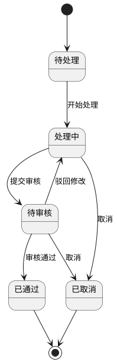
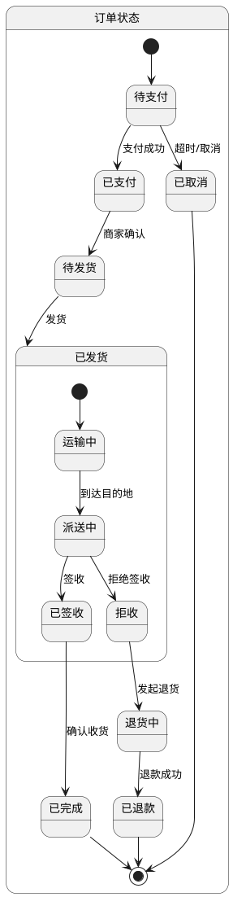
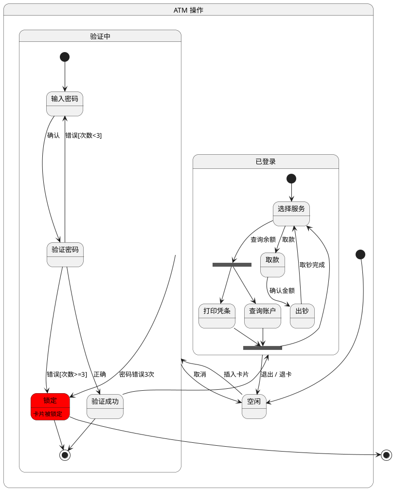

## 核心语法
- 声明包裹:
  * @startuml 和 @enduml 包裹所有内容

- 状态声明:
  * state 状态名 - 声明状态
  * state "显示名" as 别名 - 带别名
  * 简写: 直接在转换中使用状态名
  * 示例: state 待处理
  * 示例: state "等待审批" as Pending

- 初始和终止状态:
  * [*] - 初始状态（实心圆）
  * [*] - 终止状态（圆圈内实心）
  * 示例: [*] --> 状态A
  * 示例: 状态B --> [*]

- 状态转换:
  * --> 转换（实线箭头）
  * 状态A --> 状态B : 事件/条件
  * 示例: 待处理 --> 处理中 : 开始处理
  * 示例: 处理中 --> 已完成 : 完成

- 状态描述:
  * state 状态名 : 描述文本
  * 多行描述:
    state 状态名 {
        entry / 进入动作
        do / 执行动作
        exit / 退出动作
    }

- 复合状态（嵌套）:
  * state 父状态 {
        state 子状态1
        state 子状态2
        子状态1 --> 子状态2
    }
  * 最大嵌套 ≤3 层

- 并发状态:
  * 使用 -- 分隔并发区域
  * state 并发状态 {
        [*] --> 状态A
        状态A --> [*]
        --
        [*] --> 状态B
        状态B --> [*]
    }

- 注释语法:
  * 单行注释: ' 注释内容
  * 多行注释: /' 注释内容 '/

## 高级语法
- 历史状态:
  * [H] - 浅历史（记住最近子状态）
  * [H*] - 深历史（记住所有嵌套子状态）
  * 示例: [H] --> 子状态

- 选择/分支:
  * state choice1 <<choice>>
  * choice1 --> 状态A : [条件1]
  * choice1 --> 状态B : [条件2]

- 分叉和汇合:
  * state fork1 <<fork>>
  * state join1 <<join>>
  * fork1 --> 状态A
  * fork1 --> 状态B
  * 状态A --> join1
  * 状态B --> join1

- 入口/出口点:
  * state 状态 <<entryPoint>>
  * state 状态 <<exitPoint>>

- 条件守卫:
  * 语法: 状态A --> 状态B : 事件 [条件]
  * 示例: 待审批 --> 已通过 : 审批 [金额<1000]

- 动作:
  * 语法: 状态A --> 状态B : 事件 / 动作
  * 示例: 待支付 --> 已支付 : 支付成功 / 发送通知

- 图表注释:
  * note left of 状态 : 注释
  * note right of 状态 : 注释
  * note "注释" as N1

- 方向控制:
  * left to right direction
  * top to bottom direction

- 状态颜色:
  * state 状态名 #颜色
  * 示例: state 错误 #red
  * 示例: state 成功 #palegreen

## 设计建议
- 状态数量: 5-15 个为佳
- 转换数量: 8-30 条
- 嵌套层级: ≤3 层
- 每个状态: 2-5 个出向转换
- 明确初始和终止状态

## Kroki 限制
- ✓ 完全支持状态嵌套
- ✓ 支持并发状态
- ✓ 支持选择和分叉
- ✓ 支持历史状态
- ⚠️ 状态建议 ≤25 个
- ⚠️ 嵌套建议 ≤3 层

常见错误排查：
1. 注释语法错误
   ❌ // 这是注释
   ✓ ' 这是单行注释

2. 初始状态语法错误
   ❌ start --> 状态A
   ✓ [*] --> 状态A

3. 复合状态未闭合
   ❌ state 父状态 { ...（缺少 }）
   ✓ state 父状态 { ... }

4. 并发分隔符错误
   ❌ ---（三个横线）
   ✓ --（两个横线）

5. 选择节点未声明
   ❌ choice --> 状态A
   ✓ state choice <<choice>>
      choice --> 状态A

## 示例

### 示例 1

### 示例 2

### 示例 3

