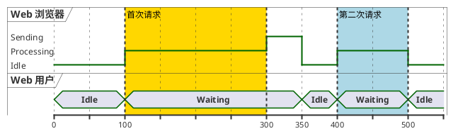

## 核心语法
- 声明包裹:
  * @startuml 和 @enduml 包裹所有内容

- 参与者类型:
  * robust "名称" as 别名 - 多状态（粗线）
  * concise "名称" as 别名 - 简洁状态（细线）
  * clock "名称" as 别名 with period N - 时钟信号
  * binary "名称" as 别名 - 二进制信号（0/1）

- 时间点定义:
  * @时间 - 设置绝对时间点
  * @+偏移 - 相对时间偏移
  * 示例: @0, @100, @+50

- 状态赋值:
  * 参与者 is 状态名
  * 参与者 is "状态描述"
  * 参与者 is {状态} - 带样式
  * 示例: Browser is Idle
  * 示例: CPU is "Processing Data"

- 时间范围:
  * @时间1 <-> @时间2 : 标签
  * 示例: @0 <-> @100 : 初始化阶段

- 注释语法:
  * 单行注释: ' 注释内容
  * 多行注释: /' 注释内容 '/

## 高级语法
- 突出显示:
  * highlight 时间1 to 时间2 : 描述
  * highlight 时间1 to 时间2 #颜色 : 描述
  * 示例: highlight 50 to 100 #Gold : 关键阶段

- 约束标注:
  * 参与者@时间1 <-> 参与者@时间2 : 约束
  * 示例: Browser@50 <-> Server@100 : RTT

- 状态颜色:
  * 参与者 is {状态名} #颜色
  * 示例: LED is {ON} #green
  * 示例: LED is {OFF} #gray

- 时间刻度:
  * scale 数值 - 设置比例
  * scale 数值 as "单位" - 带单位
  * 示例: scale 100 as "ms"

- 隐藏时间轴:
  * hide time-axis

- 二进制信号:
  * binary "信号" as sig
  * @0 sig is high
  * @10 sig is low
  * 或使用 0/1：sig is 1, sig is 0

- 时钟信号:
  * clock "CLK" as clk with period 10
  * 自动生成周期信号

- 多行状态描述:
  * 参与者 is "第一行\n第二行"

- 图表注释:
  * note left of 参与者 : 注释
  * note right of 参与者 : 注释

## 设计建议
- 参与者数量: 2-6 个为佳
- 时间跨度: 合理分段
- 状态变化: 关键时间点
- 使用 highlight 强调重要区间
- 添加时间约束标注

## Kroki 限制
- ✓ 支持 robust/concise/binary/clock
- ✓ 支持时间点和状态赋值
- ✓ 支持 highlight 和约束
- ✓ 支持时间刻度设置
- ⚠️ 参与者建议 ≤8 个
- ⚠️ 时间点建议 ≤20 个

常见错误排查：
1. 注释语法错误
   ❌ // 这是注释
   ✓ ' 这是单行注释

2. 时间点语法错误
   ❌ @ 0（空格）
   ✓ @0

3. 状态赋值语法错误
   ❌ Browser = Idle
   ✓ Browser is Idle

4. 参与者类型拼写错误
   ❌ robusr "浏览器"
   ✓ robust "浏览器"

5. 时钟周期语法错误
   ❌ clock CLK period 10
   ✓ clock "CLK" as clk with period 10


## 示例

### 示例 1



### 示例 2

```plantuml
@startuml
clock "系统时钟" as CLK with period 20
binary "复位信号" as RST
binary "使能信号" as EN
concise "状态机" as FSM

@0
RST is high
EN is low
FSM is RESET

@40
RST is low

@60
EN is high
FSM is IDLE

@100
FSM is RUN

@140
FSM is DONE

@160
EN is low
FSM is IDLE

@200
RST is high
FSM is RESET

highlight 60 to 160 : 工作周期

RST@0 <-> RST@40 : 复位时间
FSM@100 <-> FSM@140 : 处理时间
@enduml
```

### 示例 3

```plantuml
@startuml
scale 10 as "us"

robust "客户端" as Client
robust "服务器" as Server
concise "网络" as Network

@0
Client is Idle
Server is Idle
Network is Idle

@10
Client is "发送请求"
Network is "传输中"

@15
Network is Idle
Server is "接收请求"

@20
Server is "处理中"

@50
Server is "发送响应"
Network is "传输中"

@55
Network is Idle
Client is "接收响应"

@60
Client is "处理数据"

@80
Client is Idle
Server is Idle

Client@10 <-> Server@15 : 网络延迟 5us
Server@20 <-> Server@50 : 处理时间 30us
Server@50 <-> Client@55 : 网络延迟 5us

highlight 20 to 50 #LightGreen : 服务器处理
@enduml
```
