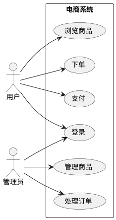
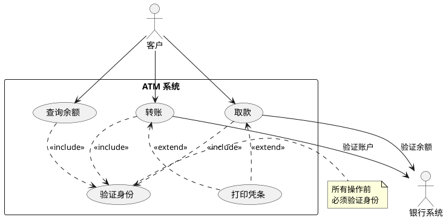
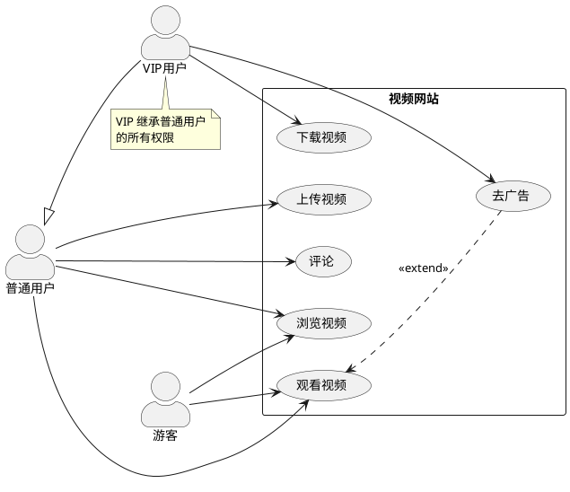

## 核心语法
- 声明包裹:
  * @startuml 和 @enduml 包裹所有内容

- 参与者声明:
  * actor 名称 - 人形图标（真人用户）
  * actor 名称 as 别名 - 带别名
  * :名称: - 简写语法
  * 示例: actor 用户
  * 示例: actor "系统管理员" as Admin

- 用例声明:
  * usecase 名称 - 椭圆形用例
  * usecase 名称 as 别名
  * (名称) - 简写语法
  * 示例: usecase 登录
  * 示例: usecase "用户注册" as UC1

- 系统边界:
  * rectangle 系统名称 { ... } - 定义系统范围
  * package 包名 { ... } - 功能分组
  * 示例:
    rectangle "电商系统" {
        usecase 登录
        usecase 下单
    }

- 关系类型:
  * --> 关联（参与者使用用例）
  * ..> 包含（include，必须执行）
  * ..> 扩展（extend，可选执行）
  * --|> 泛化（继承）
  * 示例: 用户 --> 登录
  * 示例: 登录 ..> 验证 : <<include>>
  * 示例: 登录 <.. 短信验证 : <<extend>>

- 关系标签:
  * 语法: A --> B : 标签
  * 包含: A ..> B : <<include>>
  * 扩展: A <.. B : <<extend>>
  * 注意: extend 箭头指向被扩展的用例

- 注释语法:
  * 单行注释: ' 注释内容
  * 多行注释: /' 注释内容 '/

## 高级语法
- 参与者类型:
  * actor - 人形图标（默认）
  * :名称: <<human>> - 人形
  * :名称: <<system>> - 系统图标
  * :名称: <<robot>> - 机器人图标
  * :名称: <<computer>> - 电脑图标

- 用例描述:
  * usecase UC1 as "
  用例名称
  --
  详细描述
  "

- 方向控制:
  * left to right direction - 左右布局
  * top to bottom direction - 上下布局（默认）

- 图表注释:
  * note left of 元素 : 注释
  * note right of 元素 : 注释
  * note "注释" as N1

- 样式定制:
  * skinparam actorStyle awesome - 现代风格
  * skinparam actorStyle hollow - 空心风格
  * skinparam usecase { BackgroundColor 颜色 }

- 分隔符:
  * == 标题 == - 逻辑分段

## 设计建议
- 参与者数量: 2-6 个为佳
- 用例数量: 5-15 个
- 每个参与者: 关联 2-5 个用例
- 避免过多嵌套
- include/extend 不超过 3 层

## Kroki 限制
- ✓ 完全支持所有参与者类型
- ✓ 支持 include/extend 关系
- ✓ 支持系统边界 rectangle
- ✓ 支持泛化关系
- ⚠️ 用例建议 ≤20 个
- ⚠️ 参与者建议 ≤10 个

常见错误排查：
1. 注释语法错误
   ❌ // 这是注释
   ✓ ' 这是单行注释

2. include/extend 箭头方向错误
   ❌ 登录 <.. 验证 : <<include>>（include 应指向被包含的）
   ✓ 登录 ..> 验证 : <<include>>
   ❌ 登录 ..> 短信验证 : <<extend>>（extend 应指向被扩展的）
   ✓ 登录 <.. 短信验证 : <<extend>>

3. 系统边界未闭合
   ❌ rectangle 系统 { ...（缺少 }）
   ✓ rectangle 系统 { ... }

4. 用例名称特殊字符
   ❌ usecase 用户登录/注册
   ✓ usecase "用户登录/注册" as UC1

## 示例

### 示例 1

### 示例 2

### 示例 3

